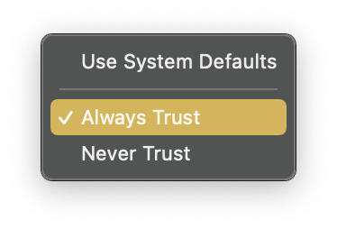

@Copy from: https://blog.phusion.nl/2020/12/22/future_of_macos_apache_modules/


# How to future proof your apache modules in macOS by signing them with your own certificate authority

> Camden Narzt
> CAMDEN NARZT
> SOFTWARE DEVELOPER
> December 22nd, 2020

## Backstory

Back when macOS 10.14 Mojave was released, Apple made a change to the Apache web-server that ships with macOS, so that it wouldn't load any modules that aren't signed by either Apple or a paid developer account. This issue affected not only Passenger users, but also users of other 3rd party modules such as php.

Error version 1 (for unsigned module):

```log
httpd: Syntax error on line 545 of /private/etc/apache2/httpd.conf: Syntax error on line 1 of /private/etc/apache2/other/passenger.conf: Cannot load /usr/local/opt/passenger-enterprise/libexec/buildout/apache2/mod_passenger.so into server: dlopen(/usr/local/opt/passenger-enterprise/libexec/buildout/apache2/mod_passenger.so, 10): no suitable image found.  Did find:
/usr/local/opt/passenger-enterprise/libexec/buildout/apache2/mod_passenger.so: code signature in (/usr/local/opt/passenger-enterprise/libexec/buildout/apache2/mod_passenger.so) not valid for use in process using Library Validation: mapped file has no cdhash, completely unsigned? Code has to be at least ad-hoc signed.

/usr/local/opt/passenger-enterprise/libexec/buildout/apache2/mod_passenger.so: stat() failed with errno=22
```

Ad hoc signing the module, like the initial Apache error told me to, resulted in a different error telling me that the signature was not sufficient for loading into Apache.

Error version 2 for ad-hoc signed module:

```log
httpd: Syntax error on line 545 of /private/etc/apache2/httpd.conf: Syntax error on line 1 of /private/etc/apache2/other/passenger.conf: Cannot load /usr/local/opt/passenger-enterprise/libexec/buildout/apache2/mod_passenger.so into server: dlopen(/usr/local/opt/passenger-enterprise/libexec/buildout/apache2/mod_passenger.so, 10): no suitable image found.  Did find:
/usr/local/opt/passenger-enterprise/libexec/buildout/apache2/mod_passenger.so: code signature in (/usr/local/opt/passenger-enterprise/libexec/buildout/apache2/mod_passenger.so) not valid for use in process using Library Validation: mapped file has no Team ID and is not a platform binary (signed with custom identity or adhoc?)

/usr/local/opt/passenger-enterprise/libexec/buildout/apache2/mod_passenger.so: stat() failed with errno=22
```

To get a Team ID, you need a paid developer account which is a non-starter for most web developers so I filed a radar with Apple and in macOS 10.14.4 this change was reverted.

## Contemporary
Fast forward to the release of Big Sur, where I noticed that Apache had a new message for me when I load Passenger:

```log 
AH06665: No code signing authority for module at /usr/local/opt/passenger/libexec/buildout/apache2/mod_passenger.so specified in LoadModule directive. Proceeding with loading process, but this will be an error condition in a future version of macOS.
```

Which is already better than the last approach because Apple is giving advance warning to users before things stop working. Looking at the /etc/apache2/httpd.conf config file that ships with macOS Big Sur, there's also a big clue as to how Apple expects developers to deal with this warning; in the module loading section of the file, this example is given:

```
# LoadModule my_custom_module /usr/local/libexec/mod_my_custom.so "My Signature Authority"
```

The "My Signature Authority" part at the end is new to Big Sur, and looks like we can specify which signing authority we want to allow for loading this Apache module. Which means it might not need to be from a paid developer account.

So to test my hypothesis the first thing we need is a code signing authority. Unfortunately Apple's directions for creating one are very sparse, and I also encountered a lot of random errors while I did so. So while I normally use GnuPG or OpenSSL to work with keys and certificates, in this case I just used the graphical tool.

## Here's what worked for me in the end.

Open Keychain Access.app 


In the Keychain Access Menu under the Certificate Assistant menu item, choose Open… [1]

Click Continue to get to the first page of options

Select Create a Certificate Authority (CA)

Click Continue to get to the next page of options
Choose a name for your new CA

Choose the email for use with this CA
Set the User Certificate dropdown to Code Signing
Click Continue to get to the next page of options
Click Continue to get to the next page of options[2]

Fill in the rest of the fields for the CA Certificate[3]

Click Continue to get to the next page of options
Click Continue to get to the next page of options

Click Continue to get to the next page of options

Click Continue to get to the next page of options

Click Continue to get to the next page of options

Ensure that Code Signing is checked in the list of capabilities

Click Continue to get to the next page of options
Ensure that Code Signing is the only capability checked in the list of capabilities, and that This extension is critical is checked

Click Continue to get to the next page of options
Click Continue to get to the next page of options

Click Continue to get to the next page of options

Click Continue to get to the next page of options

Click Continue to get to the next page of options

Click Create to create your Certificate Authority

You can close this window

Right click your CA in the main Keychain Access window and choose Get Info

Open the Trust disclosure triangle

Set the topmost trust setting to Always Trust

Close the window (you will be prompted to authenticate)

You now have your own Certificate Authority which can issue code signing certificates, progress! Now let's use it do just that and create a code signing certificate.

Open the Certificate assistant again to the What would you like to do? step (steps #2 & #3 above)
Choose Create a certificate for yourself

Click Continue to get to the next page of options
Choose a name for the certificate

Set the Identity Type to Leaf
Set the Certificate Type to Code Signing
Click Create to start the creation process
Click Continue in the popup to create the certificate[4]

Click Create to use the CA we created earlier to sign our new certificate

Make note of the Common Name field in this window, as we'll need that value later

Close the window


We now have a code signing certificate that is trusted by our mac. The next step is to sign the Apache module. This requires using the Terminal app to run the command described below.

In this command the -s flag is followed by the cert's Common Name we took note of in step #10. And the --keychain flag is followed by the path to the login keychain for your user, which will likely be the same as the example. And the last argument is the path to the module we are signing, in this case the Passenger module.

```shell
codesign -s "Camden Jared Narzt" --keychain ~/Library/Keychains/login.keychain-db /usr/local/opt/passenger/libexec/buildout/apache2/mod_passenger.so
```

Then edit the apache config file you use to load the module; in my case: /etc/apache2/other/passenger.conf.

Add the same Common Name you used in the codesign command in double quotes to the LoadModule line like so:

```
LoadModule passenger_module /usr/local/opt/passenger/libexec/buildout/apache2/mod_passenger.so "Camden Jared Narzt"
```
Checking the config with apachectl -t we see a new message:

```log
AH06662: Allowing module loading process to continue for module at /usr/local/opt/passenger/libexec/buildout/apache2/mod_passenger.so because module signature matches authority "Camden Jared Narzt" specified in LoadModule directive
```

Indicating that our system considers the module to be validly signed and will load it without issue going forward.


## Conclusion

Now you might wonder why we don't sign the module for you?

* For this to work you must have the code signing certificate which signed the module in your keychain, and we don't distribute a code signing certificate yet[5], nor does our mac build box have the ability to sign modules at this time.
* You may need the Certificate Authority certificate too in order to trust the code signing certificate, and we don't want the responsibility of being a root authority on your system.
* The most common method of installing Passenger on macOS is via Homebrew, which means we don't have the opportunity to sign the module, and Homebrew doesn't currently use or distribute a code signing certificate either.

## Footnotes
1. Even though there are more direct shortcuts to what we want to do in this sub-menu, they can trigger weird issues due to some kind of contextual behaviour bug where Certificate Assistant tries to use a random key from your system to generate the Certificate Authority Back
2. You shouldn't need to extend the Validity Period here, as long as the certificate is valid when the signature is made it should keep working Back
3. If this isn't your first Certificate Authority, you may be asked to choose a previous CA to cross sign your new CA Back
4. We don't care that others won't trust this certificate, we set our mac to trust it back when we trusted the certificate authority in step #30 Back
5. We do distribute a code signing key, however that is insufficient for this process Back