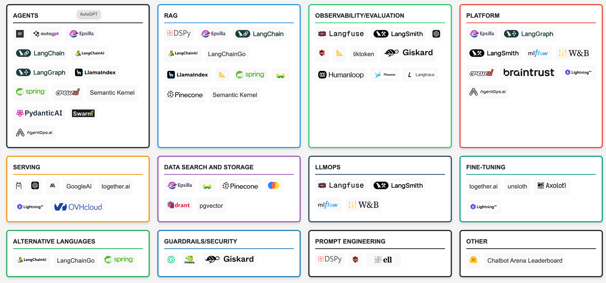

# AI

## Landscape

https://malywut.github.io/ai-engineering-landscape/

## Comments
dfdx - dfdx - Rust 16 - A pure-Rust CUDA accelerated learning toolkit.

Burn - GitHub - burn-rs/burn: Burn - A Flexible and Comprehensive Deep Learning Framework in Rust 18 - A flexible and comprehensive deep learning framework.

tch-rs - GitHub - LaurentMazare/tch-rs: Rust bindings for the C++ api of PyTorch. 12 - Bindings for the Torch library in Rust.

tract - tract - Rust 34 - A tiny, self-contained, no-nonsense library for using pre-trained models in Rust.

Candle - GitHub - huggingface/candle: Minimalist ML framework for Rust 54 - A minimalist library by HuggingFace for deep learning in Rust. Very new.

