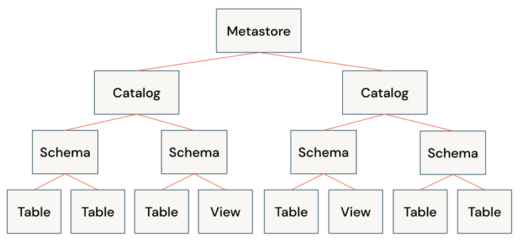
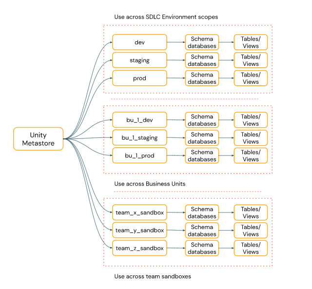
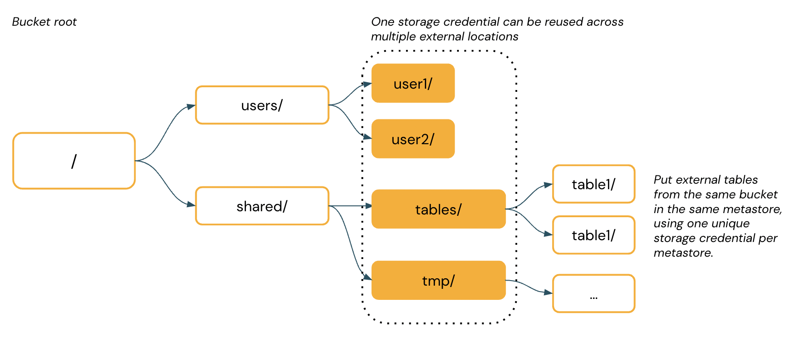

# Unity Catalog (Databricks)

**Main link:** <https://docs.databricks.com/aws/en/data-governance/unity-catalog>

Docs: <https://docs.databricks.com/aws/en/data-governance/unity-catalog> ·
Open spec: <https://www.unitycatalog.io/>

## Summary

Unity Catalog is Databricks' unified governance layer for data and AI assets
across workspaces and clouds. It replaces the workspace-scoped Hive Metastore
with a centralised, account-level metastore that exposes a three-tier namespace
— `catalog.schema.table` (or `volume`, or `function`, or `model`) — and applies
fine-grained access control, lineage, and audit on top. There is now an
open-source flavour (Unity Catalog OSS) and a Databricks-managed flavour, both
speaking a REST API that other engines (Trino, DuckDB, Spark outside
Databricks) can consume.

## Insight

The migration story is the easiest way to understand it:

- **Old world**: each Databricks workspace had its own Hive Metastore, and
  ACLs were table-level at best. Cross-workspace sharing meant copying.
- **New world**: one account-level metastore, three-tier names, row/column-level
  ACLs, attribute-based access control, and a single lineage graph. External
  locations replace per-DBFS mount config and are governed centrally.

The interesting question in 2024–2025 is **open spec vs Databricks-managed**:

- **Apache Polaris** (Snowflake-led) and the **Apache Iceberg REST catalog
  spec** are the open alternatives. If you want Iceberg tables readable by any
  engine without vendor lock-in, Polaris/Iceberg-REST is the conservative
  choice.
- **Unity Catalog OSS** is Databricks' answer — also a REST catalog, also
  speaks Iceberg REST, but with Databricks' broader asset model (volumes,
  functions, ML models) included.

If you're already on Databricks, Unity is the obvious default. If you're
multi-engine and Iceberg-first, Polaris / Iceberg REST is the safer bet.
Either way, **don't roll your own** — catalog protocols are now
commodity-ish.

## Architecture diagrams

The three-tier object model:

How catalogs map to workspaces:

External locations on AWS (S3 bucket → external location → managed by UC):

## Similar / related topics

- **Apache Polaris** — open Iceberg REST catalog, Snowflake-originated.
  <https://polaris.apache.org/>
- **Apache Iceberg REST catalog spec** — the wire protocol. <https://iceberg.apache.org/concepts/catalog/>
- **Hive Metastore** — the predecessor, still ubiquitous.
- **AWS Glue Data Catalog** — managed Hive-compatible catalog on AWS.
- **OpenMetadata** — open governance / catalog with strong lineage + quality.

## Internal links

- [[db/catalogs/README|catalogs]] — section landing.
- [[db/formats/README|formats]] — Iceberg/Delta/Parquet are what UC catalogs.
- [[db/analytics/README|analytics]] — lakehouse engines that consume UC.
- [[db/quality/README|quality]] — governance and quality often share the
  catalog as their source of truth.

## Keywords

`#unity-catalog` `#databricks` `#hive-metastore` `#governance` `#catalog` `#polaris` `#iceberg` `#lakehouse`
