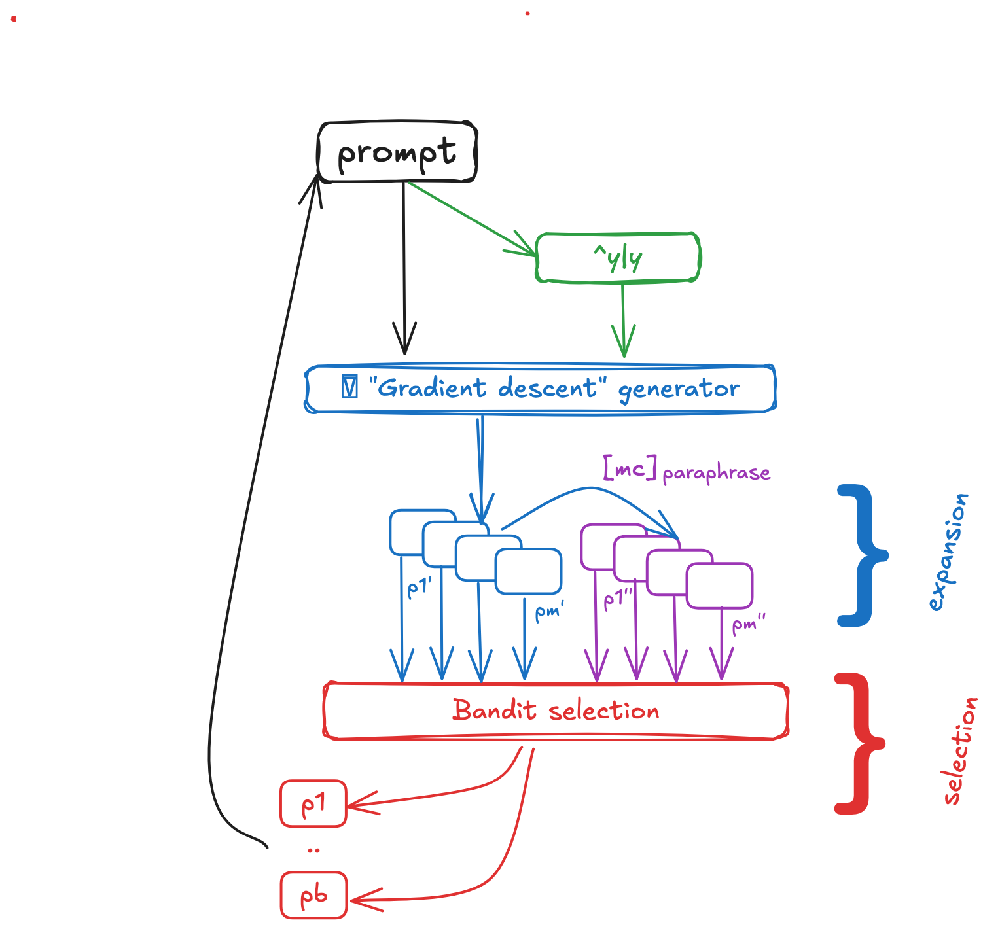
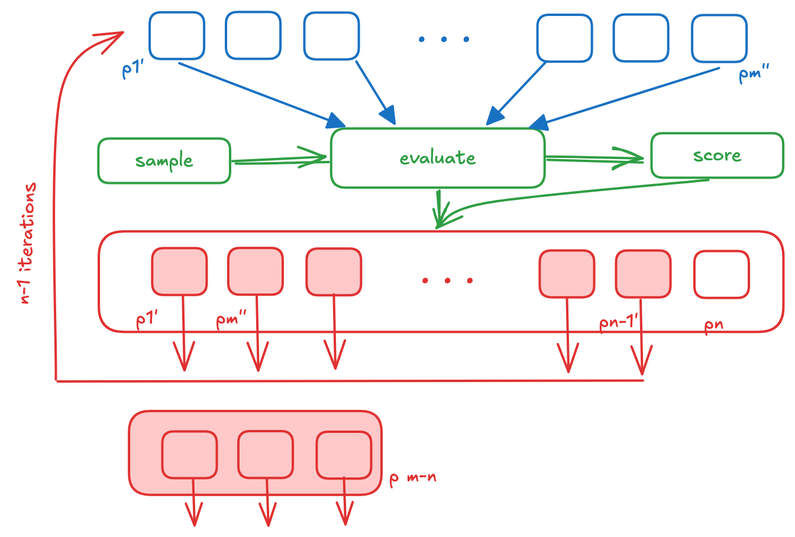
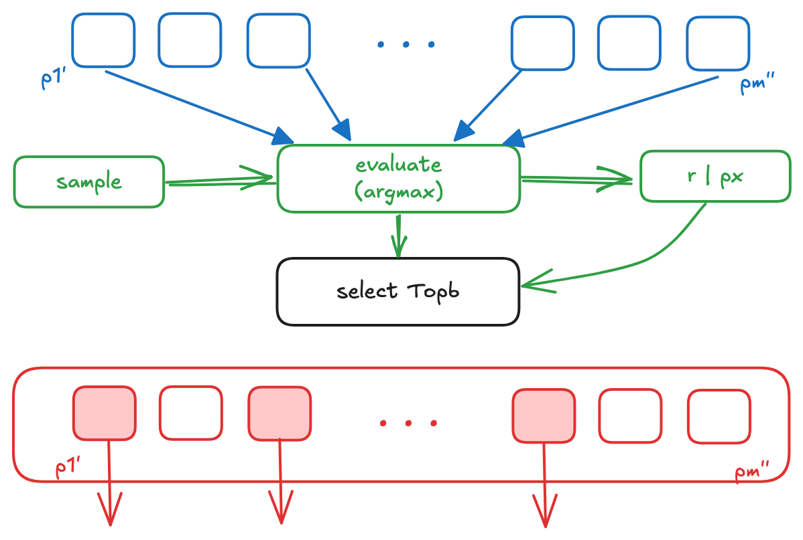

# Data quality problems in AI

Data quality in ML is a different beast from classical schema validation:
the model is *learning the distribution*, so any subtle bias, mislabel, or
drift becomes part of what the model believes about the world. The failure
modes that matter here usually don't show up as `NULL` rows or schema
mismatches — they show up as accuracy regressions, fairness issues, or
brittleness on inputs that look fine to a validator.

## Failure modes worth naming

- **Label noise** — incorrect ground-truth labels. A few percent is normal;
  beyond that you're training the model to be wrong.
- **Distribution shift** (covariate shift, concept drift) — production data
  no longer matches training data. Often silent.
- **Selection bias** — your training data is a non-uniform sample of the
  population you actually want to serve.
- **Train/test contamination** — test examples leaked into training,
  inflating evaluation. Endemic for LLMs trained on web crawls.
- **Spurious correlations / shortcut learning** — model latches on to a
  cheap feature (image background, prompt template) instead of the
  underlying signal.
- **Feedback loops** — a deployed model's outputs become part of its next
  training set, amplifying its biases.
- **Prompt / data interaction in LLMs** — quality issues that emerge only
  when a particular prompt template surfaces a particular kind of training
  example. The prompt *is* part of the data interface now.
- **Annotation drift** — multiple annotators, evolving guidelines,
  inconsistent edge cases.

## Algorithm sketches

These hand-drawn sketches walk through three foundational ideas that come up
when reasoning about training-data quality and exploration:

Gradient descent — the workhorse of ML training, and the lens through which
"a few bad rows" become "biased gradients":

Symbolic regression / SR — searching the space of expressions for a model
that fits, where data quality directly bounds what's even discoverable:

UCB (Upper Confidence Bound) — the canonical multi-armed-bandit algorithm,
relevant whenever you have to *choose which data to label or generate next*:

## See also

- [[db/quality/README|quality]] — section landing.
- [[db/quality/data_curation/README|data curation]] — the curation work that
  prevents many of these problems.
- [[data_quality]] — the classical-six-dimensions sibling.

## External pointers

- **Cleanlab** — automatic detection of label errors in classification
  datasets. <https://cleanlab.ai/>
- **whylogs** / **WhyLabs** — drift and data-quality monitoring for ML.
- **MLCommons DataPerf** — benchmarks for data-centric ML.
- **NeMo Curator** — large-scale dedup / filter / classification pipelines
  for LLM pre-training data.
- **Datatrove** (HuggingFace) — text-corpus processing for LLM training.

## Keywords

`#data-quality` `#ai` `#ml` `#label-noise` `#distribution-shift` `#llm` `#gradient-descent` `#ucb` `#exploration`
