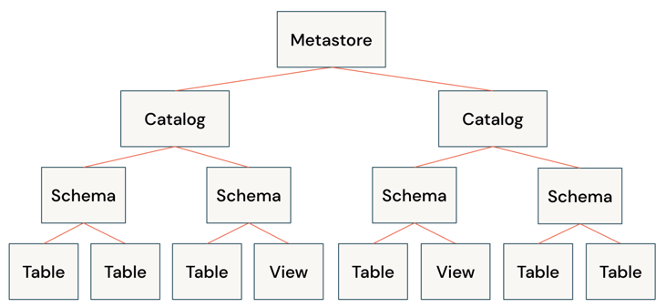
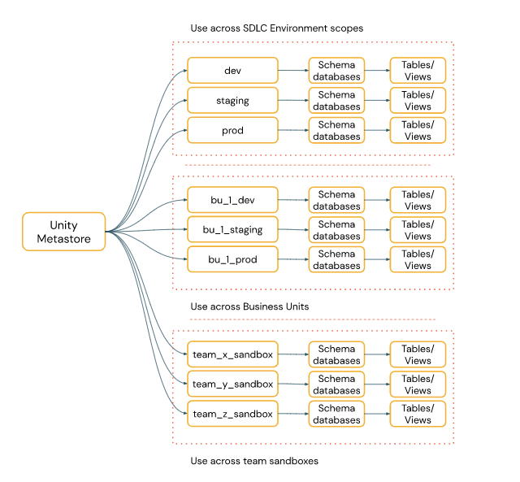
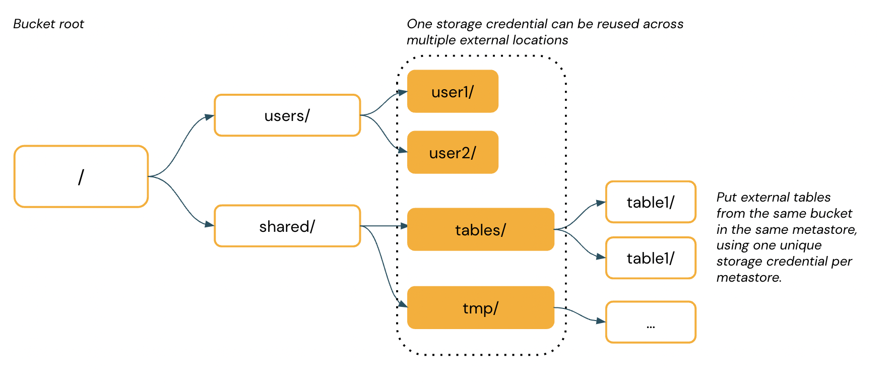

https://docs.databricks.com/data-governance/unity-catalog/best-practices.html

Unity Catalog is a fine-grained governance solution for data and AI on the Databricks Lakehouse. It helps simplify security and governance of your data by providing a central place to administer and audit data access. The following diagram illustrates the main securable objects in Unity Catalog:

A metastore is the top-level container of objects in Unity Catalog. It stores data assets (tables and views) and the permissions that govern access to them. Databricks account admins can create metastores and assign them to Databricks workspaces to control which workloads use each metastore. You create a single metastore in each region you operate and link it to all workspaces in that region. Therefore, if you have multiple regions using Databricks, you will have multiple metastores. To share data between metastores, see Delta Sharing.

Each metastore is configured with a root storage location that can be used for managed tables. You need to ensure that no users have direct access to this managed storage location. Giving access to this storage location could allow a user to bypass access controls in a Unity Catalog metastore and disrupt auditability. For these reasons, you should not reuse a bucket that is your current DBFS root file system or has previously been a DBFS root file system for the root storage location in your Unity Catalog metastore.

Organize your data
Databricks recommends using catalogs to provide segregation across your organization’s information architecture. Often this means that catalogs can correspond to software development environment scope, team, or business unit.

A schema (also called a database) is the second layer of Unity Catalog’s three-level namespace and organizes tables and views. A table can be managed or external.

Managed tables are the default way to create tables in Unity Catalog. These tables are stored in the root storage location that you configure when you create a metastore, unless you specify a different managed storage location at the catalog or schema level. Databricks recommends using managed tables whenever possible to ensure support of Unity Catalog features. All managed tables use Delta Lake.

External tables are tables whose data is stored outside of a managed storage location. They aren’t fully managed by Unity Catalog. Use external tables only when you require direct access to the data outside of Databricks clusters or Databricks SQL warehouses. External tables support Delta Lake and many other data formats, including Parquet, JSON, and CSV. External tables are a good option for providing direct access to raw data.

For more information on creating tables, see Create tables.

Manage external locations and external tables
The diagram below represents the filesystem hierarchy of a single cloud storage bucket.

There are four external locations created and one storage credential used by them all. Users and groups can be granted access to the different storage locations within a Unity Catalog metastore. This allows you to provide specific groups access to different part of the cloud storage bucket.

You can create external tables using a storage location in a Unity Catalog metastore. Those external tables can then be secured independently. Databricks recommends that you create external tables from one storage location within one schema.

Databricks strongly recommends against registering common tables as external tables in more than one metastore due to the risk of consistency issues. For example, a change to the schema in one metastore will not register in the second metastore. Use Delta Sharing for sharing data between metastores. See Delta Sharing.

