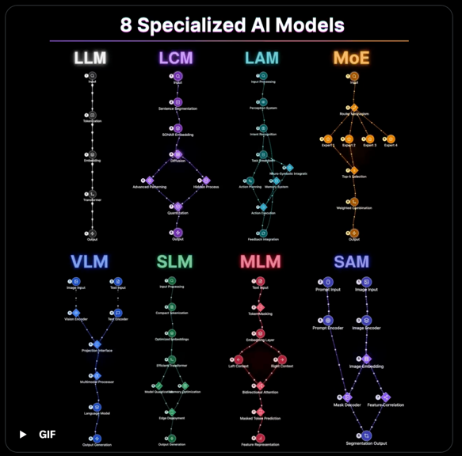

# LLMs





# Awsome Rust LLM

https://github.com/jondot/awesome-rust-llm


```

                                                                      __       __ __          
.---.-.--.--.--.-----.-----.-----.--------.-----.___.----.--.--.-----|  |_ ___|  |  .--------.
|  _  |  |  |  |  -__|__ --|  _  |        |  -__|___|   _|  |  |__ --|   _|___|  |  |        |
|___._|________|_____|_____|_____|__|__|__|_____|   |__| |_____|_____|____|   |__|__|__|__|__|

https://github.com/jondot/awesome-rust-llm
```
**Awesome Rust LLM** is an awesome style list that keeps track and curates the best Rust based LLM frameworks, libraries, tools, tutorials, articles and more. PRs are welcome!

## Models & Inference

* [llm](https://github.com/rustformers/llm) - a Rust library for running inference from a number of supported LLMs, loads [ggml](https://github.com/ggerganov/ggml) based models
* [rust-bert](https://github.com/guillaume-be/rust-bert) - all in one pipelines for for transformer-based models (BERT, DistilBERT, GPT2,...). Good for local embedding, port of `transformers` (python)
* [llm-chain](https://github.com/sobelio/llm-chain) - chaining LLMs in Rust
* [smartgpt](https://github.com/Cormanz/smartgpt) ([how it works](https://twitter.com/jondot/status/1660576729549664261))- use LLMs with the ability to complete complex tasks using plugins
* [diffusers](https://github.com/pykeio/diffusers) - Stable Diffusion using Rust, 45% faster than Pytorch
* [postgresml](https://github.com/postgresml/postgresml) - an amazing Postgres extension to do model fetching, inference all with SQL as part of your Postgres instance


## Projects

* [aichat](https://github.com/sigoden/aichat) - a pure Rust CLI implementing AI chat, with advanced features such as real-time streaming, text highlighting and more

* [browser-agent](https://github.com/m1guelpf/browser-agent/) - a headless browser driven by GPT-4. Sends off a simplified page representation and receives & executes instructions from GPT using a custom message format
* [tenere](https://github.com/pythops/tenere) - TUI interface for LLMs

How it works? here's a prompt snippet:

```
You must respond with ONLY one of the following commands AND NOTHING ELSE:
    - CLICK X - click on a given element. You can only click on links, buttons, and inputs!
    - TYPE X \"TEXT\" - type the specified text into the input with id X and press ENTER
    - ANSWER \"TEXT\" - Respond to the user with the specified text once you have completed the objective
```
* [ajeto](https://github.com/bausano/ajeto) - LLM personal assistant
* [shortgpt](https://github.com/rupeshs/shortgpt) - Ask shortgpt for instant and concise answers
* [autorust](https://github.com/minskylab/auto-rust) - macros that generate AI driven rust code in compile time
* [clerk](https://github.com/blankenshipz/clerk) - LLM based file organizer
* [gptcommit](https://github.com/zurawiki/gptcommit) - prepare commit message with GPT


## LLM Memory

* [indexify](https://github.com/diptanu/indexify) - A retrieval and long term memory service for LLMs
* [memex](https://github.com/spyglass-search/memex) - Super-simple, fully Rust powered "memory" (doc store + semantic search) for LLM projects, semantic search, etc.
* [motorhead](https://github.com/getmetal/motorhead) -  a memory and information retrieval server for LLMs.
    * Uses Redis as vector store for long term memory,
    * Works with OpenAI API
    * [js example](https://github.com/getmetal/motorhead/blob/main/examples/chat-js), [python example](https://github.com/getmetal/motorhead/blob/main/examples/chat-py)

## Core Libraries

* [tiktoken](https://github.com/openai/tiktoken) - tiktoken is a Python library with a Rust core implementing a fast [BPE](https://en.wikipedia.org/wiki/Byte_pair_encoding) tokeniser for use with OpenAI's models
    * BPE is done in Rust
    * Made by OpenAI

* [tiktoken-rs](https://github.com/zurawiki/tiktoken-rs) - a Rust focused library based on the `tiktoken` core with additional enhancements for use in Rust code. (Pyton parts in `tiktoken` done in pure Rust)

```rust
// Rust
use tiktoken_rs::p50k_base;

let bpe = p50k_base().unwrap();
let tokens = bpe.encode_with_special_tokens(
  "This is a sentence   with spaces"
);
println!("Token count: {}", tokens.len());
```

* [polars](https://github.com/pola-rs/polars) - a faster, pure Rust pandas alternative

* [rllama](https://github.com/Noeda/rllama) - a pure Rust implemenation of LLaMa inference. Great for embedding into other apps or wrapping for a scripting language.
* [whatlang](https://github.com/quickwit-oss/whichlang) - Rust library using a multiclass logistic regression model to detect languages

* [OpenAI API](https://github.com/uiuifree/rust-openai-chatgpt-api)  - a strongly typed Rust client for the OpenAI API

## Tools

* [spider](https://github.com/spider-rs/spider) - crawler / spider written in Rust for when you need a whole-website dump. Unlike Scrapy, focuses on dumping data but the post-processing is done later.

## Services

* [dust](https://github.com/dust-tt/dust) - a full service for workflow running with composable blocks. Core is in Rust, various frontends in Typescript.


## Vector Stores

* [pgvecto.rs](https://github.com/tensorchord/pgvecto.rs) - Vector database plugin for Postgres, written in Rust, specifically designed for LLM. 20x faster than pgvector
* [qdrant](https://github.com/qdrant/qdrant) - Qdrant - Vector Database for the next generation of AI applications


## LLM

https://github.com/rustformers/llm

llm - Large Language Models for Everyone, in Rust
llm is an ecosystem of Rust libraries for working with large language models - it's built on top of the fast, efficient GGML library for machine learning.


