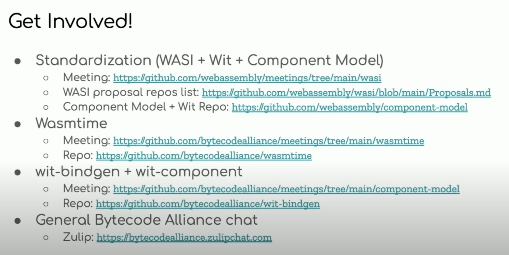

<!-- auto-stubbed by article_stub.py -->
<!-- keywords-extended by P6.5 -->

# WASM

**Main link:** <https://github.com/yewstack/yew>

## Summary

<!-- TODO: 2-5 sentences. What is this? Who made it? What does it do? -->

## Insight

<!-- TODO: Why care? When and where to reach for this? Gotchas, opinions, comparisons. -->

## Similar / related topics

<!-- TODO: 3-5 bullets, each "name — 1-line description". -->

## Internal links

<!-- internal-links-suggested by P6.3 -->
> Auto-suggested by P6.3. Review, prune, and replace this comment with `<!-- reviewed -->` once curated.

- [[yew]] — YEW _(score 46.3)_
- [[gloo]] — Gloo _(score 33.0)_
- [[programming/rust/web/observability_on_wasm|observability_on_wasm]] — obsetrvability on wasm _(score 24.1)_
- [[wasmtime]] — wasmtime _(score 24.1)_
- [[javascript]] — Javascript _(score 20.2)_

<!-- TODO: review the auto-suggested links above; remove low-signal ones, add ones P6.3 missed. -->
## Keywords

`#webassembly` `#web` `#rust` `#programming` `#yew` `#developers` `#javascript` `#gloo`

## TODO

- Write a real `## Summary` (2-5 sentences) replacing the auto-stub placeholder.
- Write a real `## Insight` (when/why/where to use) replacing the auto-stub placeholder.
- Add 3-5 entries under `## Similar / related topics`.
- Add `[[wikilinks]]` to at least 2 related articles in the vault under `## Internal links`.
- Promote `status: draft` to `status: reviewed` once the rewrite is complete.

## References / raw notes
<!-- auto-split by article_split.py -->
> Auto-split: 5 additional top-level heading(s) extracted into sibling files:
> - [wasmtime](wasmtime.md)
> - [Dioxus](../gui/dioxus.md) (the original heading was a `[CHECK!]` reminder pointing at a nonexistent `gui/gui.mdi.md`; the real article is `programming/rust/gui/dioxus.md` and the empty split stub was deleted)
> - [YEW](yew.md)
> - [Gloo](gloo.md)
> - [obsetrvability on wasm](observability_on_wasm.md)

<!-- Original content preserved verbatim below. Curate / prune during rewrite. -->

# WASM

https://github.com/WebAssembly
(general) proposals, status, meetings, 

https://github.com/bytecodealliance
(rust) wasmtime, tools, runtime, bindgen,

Update 202211:

This is still work in progress - but good direction. 
Soon there willbe async support and hopefully cloud.

Some good thoughts and intro: https://www.youtube.com/watch?v=DkpNqcfuPOM
