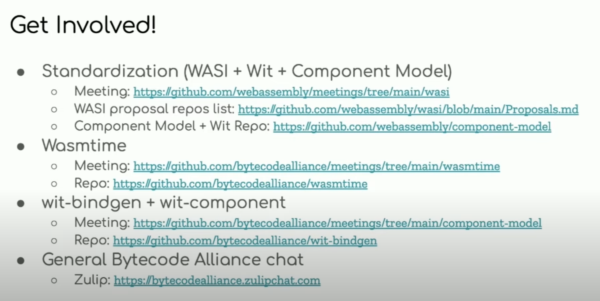

# WASM

https://github.com/WebAssembly
(general) proposals, status, meetings, 

https://github.com/bytecodealliance
(rust) wasmtime, tools, runtime, bindgen,

Update 202211:

This is still work in progress - but good direction. 
Soon there willbe async support and hopefully cloud.

Some good thoughts and intro: https://www.youtube.com/watch?v=DkpNqcfuPOM

# wasmtime

https://crates.io/crates/wasmtime

# Dioxus [CHECK!](dioxus.md)

# YEW

https://yew.rs/

https://github.com/yewstack/yew

Yew is a modern Rust framework for creating multi-threaded front-end web apps using WebAssembly.

It features a component-based framework which makes it easy to create interactive UIs. Developers who have experience with frameworks like React and Elm should feel quite at home when using Yew.
It achieves great performance by minimizing DOM API calls and by helping developers to easily offload processing to background threads using web workers.
It supports JavaScript interoperability, allowing developers to leverage NPM packages and integrate with existing JavaScript applications.

# Gloo
A toolkit for building fast, reliable Web applications and libraries with Rust and Wasm.

Gloo is a collection of libraries, and those libraries provide ergonomic Rust wrappers for browser APIs. web-sys/js-sys are very difficult/inconvenient to use directly so provides wrappers around the raw bindngs which makes it easier to consume those APIs. This is why it is called a "toolkit", instead of "library" or "framework".

# obsetrvability on wasm

https://github.com/dylibso/observe-sdk

https://github.com/dylibso/observe-sdk/tree/main/rust

