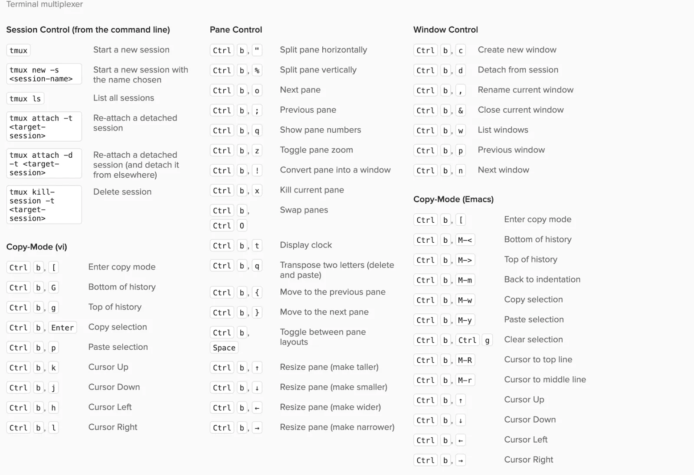

# TMUX

few most important comand and shortcuts:



```shell

tmux ls
tmux attach -t <>
tmux attach -d -t <>
tmux kill-session -t <>

# INSIDE:
Ctrl b-d 
Ctrl b-[
```


# Tmux AI


https://tmuxai.dev/

```shell
CHAT PANE
TmuxAI» start docker container mysql and then connect to mysql shell.
First I'll start the container:
TmuxAI» docker run --name mysql_container -e MYSQL_ROOT_PASSWORD=password -d mysql:latest
Do you want to execute this command? [Y]es/No/Edit:
TmuxAI» Now I will connect to the mysql shell.
TmuxAI» docker exec -it mysql_container mysql -u root -p
Do you want to execute this command? [Y]es/No/Edit:
TmuxAI» I'll now send the password to the mysql shell.
TmuxAI» Sending keys: password
TmuxAI» Sending keys: Enter
TmuxAI» I've successfully connected to the MySQL shell.

```
