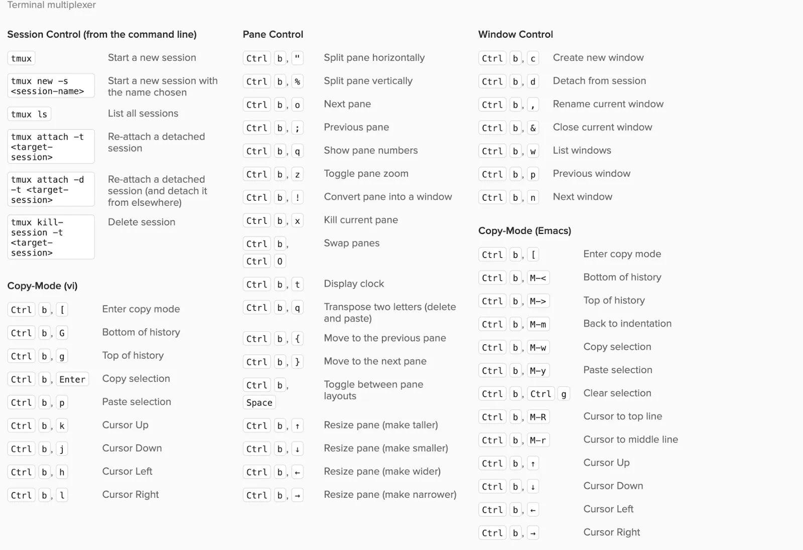

# tmux — terminal multiplexer

**Main link:** <https://github.com/tmux/tmux>

Wiki: <https://github.com/tmux/tmux/wiki> · Cheat sheet: <https://tmuxcheatsheet.com/>

## Summary

tmux is a terminal multiplexer: it lets you run many terminals inside a single screen, detach from a session and re-attach to it later (so a long-running job survives an SSH disconnect), and split a window into panes. Originally by Nicholas Marriott (2007) as a BSD-licensed successor to GNU Screen. The de facto standard for "I want a remote session that doesn't die when my Wi-Fi drops".

## Insight

The core mental model is **session → window → pane**. A *session* persists on the server independently of any client; you `attach`/`detach` clients to it. A session has many *windows* (think tabs); each window has one or more *panes* (splits). Sessions outlive your SSH connection; that is the whole point.

Comparison vs the alternatives:

- **vs [[zellij]]**: tmux is older, scripted in shell + `tmux` commands, configured in a one-file DSL (`~/.tmux.conf`). Zellij is Rust, has a status bar and floating panes out of the box, and is *much* more discoverable. Pick tmux if you need maximum portability and an enormous plugin/recipe ecosystem; pick Zellij if you're starting fresh and want sane defaults.
- **vs [[byobu]]**: Byobu is a friendly preset on top of tmux (or screen) with F-key bindings and a status bar. If you like Byobu's defaults, you basically *are* using tmux.
- **vs raw [GNU Screen](https://www.gnu.org/software/screen/)**: tmux has a saner config language, vertical splits are first-class, and it's still actively developed. Almost no one should pick Screen over tmux on a fresh box.

Combine with [[mosh]] for resilient remote dev: `mosh user@host -- tmux new -A -s main`.

The recommended plugin manager is [tpm](https://github.com/tmux-plugins/tpm); the must-have plugins are [tmux-resurrect](https://github.com/tmux-plugins/tmux-resurrect) (save/restore sessions across reboots) and [tmux-continuum](https://github.com/tmux-plugins/tmux-continuum) (auto-save).

## Similar / related topics

- [[zellij]] — the modern Rust alternative; better defaults, smaller ecosystem.
- [[byobu]] — opinionated preset over tmux/screen.
- [GNU Screen](https://www.gnu.org/software/screen/) — the original multiplexer; tmux's predecessor.
- [[tmux_ai]] — LLM-driven wrapper that can *send keys* to your panes.
- [[mosh]] — pair with tmux for "always-on" remote sessions.

## Internal links

- [[zellij]]
- [[byobu]]
- [[tmux_ai]]
- [[mosh]]
- [[helix]]

## Keywords

`#tmux` `#multiplexer` `#terminal` `#sessions` `#panes` `#screen` `#linux` `#ssh`

## References / raw notes

### Most important commands and shortcuts



```shell
tmux ls                       # list sessions
tmux attach -t <name>         # attach to a session
tmux attach -d -t <name>      # detach other clients, attach
tmux kill-session -t <name>   # kill a session
tmux new -s <name>            # create a named session
tmux new -A -s <name>         # attach if exists else create (idempotent)
```

### Inside a session (default prefix is `Ctrl-b`)

| Keys              | Action                              |
| ----------------- | ----------------------------------- |
| `Ctrl-b d`        | Detach from session                 |
| `Ctrl-b [`        | Enter copy / scrollback mode        |
| `Ctrl-b c`        | New window                          |
| `Ctrl-b n` / `p`  | Next / previous window              |
| `Ctrl-b %`        | Vertical split                      |
| `Ctrl-b "`        | Horizontal split                    |
| `Ctrl-b o`        | Cycle pane focus                    |
| `Ctrl-b z`        | Toggle pane zoom                    |
| `Ctrl-b ?`        | List all key bindings               |

### Recommended `~/.tmux.conf` starting points

```tmux
# Use Ctrl-a as prefix (like screen)
unbind C-b
set -g prefix C-a
bind C-a send-prefix

# Mouse on
set -g mouse on

# Start window numbering at 1
set -g base-index 1
setw -g pane-base-index 1

# Bigger scrollback
set -g history-limit 100000

# Reload config
bind r source-file ~/.tmux.conf \; display "Reloaded!"
```

### Plugins worth installing (via tpm)

- `tmux-plugins/tpm` — the plugin manager.
- `tmux-plugins/tmux-resurrect` — save/restore sessions across reboot.
- `tmux-plugins/tmux-continuum` — auto-save resurrect snapshots.
- `tmux-plugins/tmux-yank` — system-clipboard integration.
