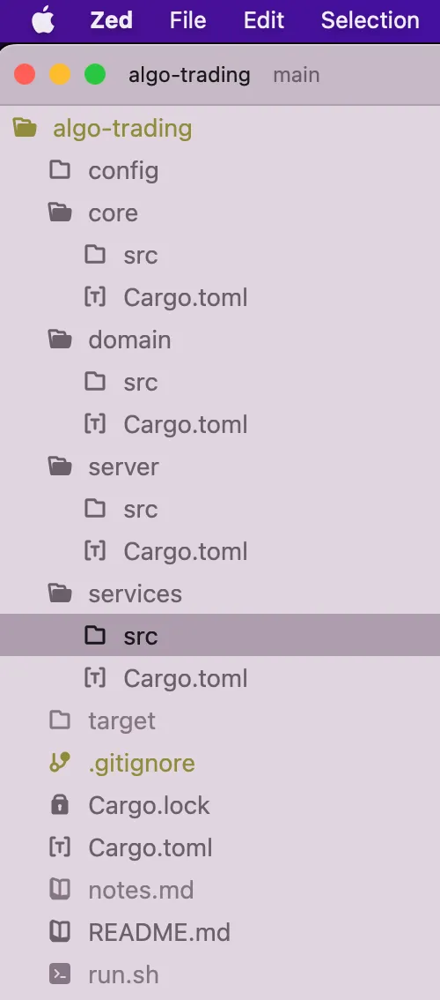

# Algo trading


https://github.com/Paul-Folbrecht/algo-trading
 looks like could work ..


https://gist.github.com/Paul-Folbrecht/


his article:
https://medium.com/rustaceans/a-basic-algo-trading-system-in-rust-part-ii-c47d10d3bf9c


# A Basic Algo Trading System In Rust: Part I
Paul Folbrecht
Rustaceans

Jun 8, 2024


## Introduction
Writing a personal algorithmic trading system is a fantastic way to make substantial amounts of money with minimal effort.

Ha! If only that were so. No, because of the efficiency of equity and other liquid markets, etc., easy money is not to be had.

However, writing such a system for fun and as a learning exercise (both technical and trading) is certainly worthwhile. This series will demonstrate the creation of a such a system, simple but fully-functional, in Rust.

A query is prompted: Why Rust? Python is, by far, the most popular programming language for algo traders. With Python & numpy, one can be off to the races in a hurry.

But a language like Rust still has much appeal:

It is blazingly fast, natively (not just with libs written in C). There are contexts where this matters.
It is far more flexible — in a sense, infinitely so, compared to programming with a glue language using canned libraries.
It’s much more robust, even than Python, and certainly compared to any other systems-level language
While the system presented here is ‘toy’ in the sense that the one simple strategy presented is unlikely to generate alpha, except by coincidence or with highly-educated choosing of names, the system is also a reasonably complete framework, with pluggable trading strategies. Thus, anything is possible.

The piece is more about Rust application architecture and idiomatic programming than it is about the domain.

Complete source code is available.

## Functionality
I’m going to assume little-to-no understanding of algorithmic trading. The basics functional requirements of such a system are as follows:

Gather live and historical market data
Feed that data to a trading strategy which can determine to buy or sell securities
[Optional: Run proposed trades through some sort of risk system. We’ll consider risk assessment out-of-scope here — something to be decided non-programmically.]
Place and track orders, and positions
In 2024, there are a number of very good commercial trading API offerings. I chose to use the Tradier system for the following reasons:

Good reputation for completeness of functionality, reliability, and customer service
It provides both live and historical data, and full order/position functionality
Reasonable pricing
Architectural Decision Record
Having had good success with so-called onion architecture (most recently specifically with the ZIO Service Pattern in Scala, incidentally), I sought to discover if this was an appropriate architecture for Rust applications. It turns out that it is, with certain caveats specific to this language.

In that vein, I created a workspace-based project, with several libraries with dependencies all pointing in the right direction: from services to domain to core. That is, the most critical part of the application, domain, where business logic lives, has no dependencies on I/O or technical implementation concerns.


## Services
Starting from a clean, rusty slate, as I set out to do, the simplest solution is bare functions. But we need to be able to do at least one other thing: Mock implementations for unit testing. With that in mind, using some mechanism to group related functions together and change the implementation at will seems like a good idea.

Thankfully, Rust is not an object-oriented language; rather than bundling the rather disparate elements of interface, encapsulation, and dispatch/polymorphism together, it keeps these concerns distinct and allows one to compose them appropriately, as desired.

The interface mechanism in Rust is the trait: Traits groups related sets of functions together which can be implemented in various ways.

With traits and struct implementations, we can implement a simple but entirely adequate mechanism of dependency injection, and thus make our code unit-testable.

There are essentially two ways to use traits to achieve pluggable implementations in Rust: Static (compile-time) binding — impl Trait — and dynamic binding — the dyn Trait mechanism. I chose the former, for reasons I won’t get in to here, but both are viable, and the slight performance hit of dynamic binding would not be an issue for service-level interaction.

## Concurrency
It is advantageous for almost all nontrivial applications to make use of some sort of parallelism mechanism. Here, we know we are going to have several disparate concerns that should ideally run in parallel:

Responding to market events
Making trading decisions
Placing or editing orders
With that in mind, I made the following decisions:

A single process: There is no reason here to incur the overhead of both additional structural complexity and poorer performance that breaking the system into microservices would incur. Rather, we will use a clean logical dependency structure to keep application portions appropriately isolated
No async: This type of application will never be in the position of handling a large number of concurrent I/O events. Thus, we do not need to multiplex threads onto tasks, and going async has no real purpose here. (Async Rust is, in a sense, a beast unto itself, and best avoided unless you need what it buys you — IMHO.)
Channels rather than ZeroMQ or another in process messaging mechanism. Rust’s built-in channels are an excellent mechanism for decoupling in-process components; there is no reason in Rust to use a third-party messaging library for this type of use case. Doing so we needlessly increase complexity And likely decrease performance.
Getting into the weeds, I chose tungstenite over ezsockets for websocket support, crossbeam over native channels because they add useful functionality at no real cost, and the ubiquitous reqwest library for HTTP, along with its pal serde for serialization.
Code


Though this is an exercise in building a real-world, relatively complex system in Rust, some elements of true production-grade software are missing:

Use of a proper ADT error system rather than ‘String’
Clean shutdown [Update: Handled in a later iteration.]
With that prelude, it’s time to get into the code — parts of it, that is. We won’t be covering here utilities (core), unit tests, and other less interesting bits.

We’ll start with fn main.

```rust
fn main() {
    let config = AppConfig::new().expect("Could not load config");
    println!("Config:\n{:?}", config);
    let args: Vec<String> = std::env::args().collect();
    let access_token = &args[1];
    let market_data_service = market_data::new(access_token.to_string());
    let historical_data_service = historical_data::new(access_token.to_string());
    let shutdown = Arc::new(AtomicBool::new(false));
    let mut symbols: HashSet<String> = HashSet::new();

    config.strategies.iter().for_each(|strategy| {
        symbols.extend(strategy.symbols.clone());
        let mut trading_service = trading::trading::new(
            strategy.name.clone(),
            strategy.symbols.as_ref(),
            market_data_service.clone(),
            historical_data_service.clone(),
        );
        match trading_service.run() {
            Ok(_) => (),
            Err(e) => eprintln!("Error starting TradingService {}: {}", strategy.name, e),
        }
    });

    let handle = market_data_service.init(shutdown, symbols.into_iter().collect());
    match handle.unwrap().join() {
        Ok(_) => println!("MarketDataService thread exited successfully"),
        Err(e) => eprintln!("Error joining MarketDataService thread: {:?}", e),
    }
}
```

main loads the application’s config, which specifies the trading strategies to be instantiated along with their parameters, then instantiates them with the dependent services.

Note that a set of symbols to be monitored by market data is constructed from the parameters of all configured strategies. This is done for efficiency: We want to use a single websocket for all market data events.

The config, as noted, supports n trading strategies:

```yaml
[[strategies]]
name = "mean-reversion"
symbols = ["SPY", "AAPL"]

# [[strategies]]
# name = "pairs"
# symbols = []
```

The system in its present state supports only mean-reversion as a strategy, but is set up to configure and create any number of any type of trading strategy implementation.

Market data sources are, in a sense, the heart of any trading system. No live data, no trading.

```rust
pub trait MarketDataService {
    fn init(
        &self,
        shutdown: Arc<AtomicBool>,
        symbols: Vec<String>,
    ) -> Result<JoinHandle<()>, String>;
    fn subscribe(&self) -> Result<Receiver<Quote>, String>;
    fn unsubscribe(&self, subscriber: Receiver<Quote>) -> Result<(), String>;
}

pub fn new(access_token: String) -> Arc<impl MarketDataService> {
    Arc::new(implementation::MarketData {
        access_token,
        socket: None,
        symbols: HashSet::new(),
        subscribers: Arc::new(Mutex::new(Vec::new())),
    })
}

mod implementation {
    use super::*;

    #[derive(Deserialize)]
    struct AuthResponse {
        stream: Stream,
    }

    #[derive(Deserialize)]
    struct Stream {
        sessionid: String,
    }

    pub struct MarketData {
        pub access_token: String,
        pub socket: Option<WebSocket<MaybeTlsStream<TcpStream>>>,
        pub symbols: HashSet<String>,
        pub subscribers: Arc<Mutex<Vec<(Sender<Quote>, Receiver<Quote>)>>>,
    }

    impl MarketDataService for MarketData {
        fn init(
            &self,
            shutdown: Arc<AtomicBool>,
            symbols: Vec<String>,
        ) -> Result<JoinHandle<()>, String> {
            let response = authenticate(&self.access_token).expect("Error authenticating");
            let session_id = &response.stream.sessionid;
            let symbols_json = serde_json::to_string(&symbols).expect("Error serializing symbols");

            match connect("wss://ws.tradier.com/v1/markets/events") {
                Ok((mut socket, _)) => {
                    let message = format!(
                        "{{\"symbols\": {}, \"sessionid\": \"{}\", \"filter\": [\"quote\"], \"linebreak\": true}}",
                        symbols_json,
                        session_id
                    );
                    socket
                        .send(Message::Text(message))
                        .expect("Error sending message");

                    let subscribers = self.subscribers.clone();
                    let handle = std::thread::spawn(move || {
                        while !shutdown.load(std::sync::atomic::Ordering::Relaxed) {
                            let msg = socket
                                .read()
                                .expect("Error reading message")
                                .into_text()
                                .expect("Error converting message to text");
                            let quote = serde_json::from_str::<Quote>(msg.as_str())
                                .expect("Error parsing JSON");
                            println!("MarketDataService received quote: {:?}", quote);
                            for subscriber in subscribers.lock().unwrap().iter() {
                                match subscriber.0.send(quote.clone()) {
                                    Ok(_) => (),
                                    Err(e) => eprintln!("Error sending quote to subscriber: {}", e),
                                }
                            }
                        }
                    });

                    Ok(handle)
                }

                Err(e) => Err(e.to_string()),
            }
        }

        fn subscribe(&self) -> Result<Receiver<Quote>, String> {
            let (sender, receiver) = unbounded();
            let subscriber = receiver.clone();
            self.subscribers
                .lock()
                .and_then(|mut s| Ok(s.push((sender, receiver))))
                .map_err(|e| e.to_string())
                .and_then(|_| Ok(subscriber))
        }

        fn unsubscribe(&self, subscriber: Receiver<Quote>) -> Result<(), String> {
            match self.subscribers.lock() {
                Ok(mut guard) => {
                    let subscribers: &mut Vec<(Sender<Quote>, Receiver<Quote>)> = &mut *guard;
                    if let Some(index) = subscribers
                        .iter()
                        .position(|(_, r)| std::ptr::eq(r, &subscriber))
                    {
                        subscribers.remove(index);
                        Ok(())
                    } else {
                        return Err("No such subscriber found".to_string());
                    }
                }
                Err(e) => return Err(e.to_string()),
            }
        }
    }

    fn authenticate(access_token: &str) -> reqwest::Result<AuthResponse> {
        match reqwest::blocking::Client::new()
            .post("https://api.tradier.com/v1/markets/events/session")
            .header(AUTHORIZATION, format!("Bearer {}", access_token))
            .header(ACCEPT, "application/json")
            .header(CONTENT_LENGTH, "0")
            .send()?
            .json::<AuthResponse>()
        {
            Ok(r) => Ok(r),
            Err(e) => {
                eprintln!("Error: {}", e);
                Err(e)
            }
        }
    }
}

#[cfg(test)]
#[path = "./tests/market_data_test.rs"]
mod market_data_test;

```

This gist demonstrates the pattern for services I followed throughout the app (some parts of which are unique, AFAIK):

A trait for the interface (because I’m not using dynamic binding with trait objects, I’m able to use generic types in these interfaces, though we don’t see that here)
An fn new() constructor that returns impl Trait wrapped by an Arc — the Arc is necessary to allow shared access (among threads) to the service
An implementation by struct hidden in a submodule; this is not necessary for visibility reasons (of course, non-pub members of the module are not visible outside it, except to submodules); I did this for organizational purposes only
Unit tests in a separate file using the #path macro (contrary to the Rust norm of putting tests in the same file as the production code —sorry but that’s just a bad norm)
Implementation elements:

subscribe() registers a subscriber by creating an unbounded channel.
init() connects a websocket to the Tradier market data streaming endpoint. The system collected symbols from all registered trading strategies (above) — this set is sent to the socket to register for events. Note also that we are filtering on “quote” events. See the Tradier API Docs for details.
init() then spawns a thread to listen to the websocket and send quotes to subscribers
The subscribers collection is guarded by a mutex. Unlike legacy languages, mutexes in Rust not only guard data but also own it, making it impossible to mutate without acquiring a lock.
Finally, note that you must acquire a Tradier API access token in order to use the system. This is passed as a command-line argument to the process.

[Update: Secrets are now handled by the environment.]

Historical data is also necessary for virtually every trading strategy.

At first blush, one might assume that live and historical data should be abstracted behind a common interface. But this is not accurate — the data provided is different, which is reflected by our structs, which mirror Tradier (and other) API responses:

```rust
#[derive(Deserialize, Debug, Clone)]
pub struct Quote {
    pub symbol: String,
    pub bid: f64,
    pub ask: f64,
    #[serde(with = "tradier_date_time_format")]
    pub biddate: DateTime<Local>,
    #[serde(with = "tradier_date_time_format")]
    pub askdate: DateTime<Local>,
}

#[derive(Deserialize, Debug)]
pub struct History {
    pub day: Vec<Day>,
}

#[derive(Deserialize, Debug)]
pub struct Day {
    #[serde(with = "tradier_date_format")]
    pub date: NaiveDate,
    pub open: f64,
    pub high: f64,
    pub low: f64,
    pub close: f64,
    pub volume: i64,
}

```

So, “live” and “historical” quotes are fundamentally different.

(But, “live” doesn’t necessarily always mean literally “live”: When we get to backtesting, “live” quotes will actually be historical.)

Here’s the service code:


This is simpler than the MarketDataService, as it uses a simple HTTP Get request rather than a websocket (because this isn’t live data).

Now we’re onto the good stuff — TradingService:

```rust
pub trait TradingService {
    fn run(&mut self) -> Result<(), String>;
}

pub fn new<'market_data>(
    strategy_name: String,
    symbols: &'market_data Vec<String>,
    market_data_service: Arc<impl MarketDataService + 'market_data + Send + Sync>,
    historical_data_service: Arc<impl HistoricalDataService + 'market_data + Send + Sync>,
) -> impl TradingService + 'market_data {
    implementation::Trading {
        strategy_name,
        symbols,
        market_data_service,
        historical_data_service,
        thread_handle: None,
    }
}

mod implementation {
    use super::*;
    use chrono::Local;
    use domain::domain::SymbolData;
    use std::collections::HashMap;

    pub struct Trading<
        'market_data,
        M: MarketDataService + Send + Sync,
        H: HistoricalDataService + Send + Sync,
    > {
        pub strategy_name: String,
        pub symbols: &'market_data Vec<String>,
        pub market_data_service: Arc<M>,
        pub historical_data_service: Arc<H>,
        pub thread_handle: Option<std::thread::JoinHandle<()>>,
    }

    impl<
            'market_data,
            M: MarketDataService + Send + Sync,
            H: HistoricalDataService + Send + Sync,
        > TradingService for Trading<'market_data, M, H>
    {
        fn run(&mut self) -> Result<(), String> {
            println!(
                "Running TradingService with strategy: {:?}",
                self.strategy_name
            );
            let symbol_data = load_history(self.symbols, self.historical_data_service.clone());

            match self.market_data_service.subscribe() {
                Ok(rx) => {
                    println!("TradingService subscribed to MarketDataService");
                    let strategy = Strategy::new(&self.strategy_name, self.symbols.clone());
                    self.thread_handle = Some(std::thread::spawn(move || loop {
                        match rx.recv() {
                            Ok(quote) => {
                                println!("TradingService received quote:\n{:?}", quote);
                                if let Some(symbol_data) = symbol_data.get(&quote.symbol) {
                                    strategy.handle(&quote, symbol_data);
                                }
                            }
                            Err(e) => {
                                eprintln!("Error on receive!: {}", e);
                            }
                        }
                    }));
                }

                Err(e) => return Err(format!("Failed to subscribe to MarketDataService: {}", e)),
            }
            Ok(())
        }
    }

    fn load_history<'market_data>(
        symbols: &'market_data Vec<String>,
        historical_data_service: Arc<impl HistoricalDataService + 'market_data>,
    ) -> HashMap<String, SymbolData> {
        symbols
            .iter()
            .map(|symbol| -> (String, SymbolData) {
                let end = Local::now().naive_local().date();
                let start = end - chrono::Duration::days(20);
                println!("Loading history for {} from {} to {}", symbol, start, end);
                let query: Result<Vec<domain::domain::Day>, reqwest::Error> =
                    historical_data_service
                        .fetch(symbol, start, end)
                        .map(|h| h.day);
                match query {
                    Ok(history) => {
                        let sum = history.iter().map(|day| day.close).sum::<f64>();
                        let len = history.len() as f64;
                        let mean = sum / len;
                        let variance = history
                            .iter()
                            .map(|quote| (quote.close - mean).powi(2))
                            .sum::<f64>()
                            / len;
                        let std_dev = variance.sqrt();
                        let data = SymbolData {
                            symbol: symbol.clone(),
                            history,
                            mean,
                            std_dev,
                        };
                        println!("Loaded history for {}: {:?}", symbol, data);
                        (symbol.to_owned(), data)
                    }
                    Err(e) => panic!("Can't load history for {}: {}", symbol, e),
                }
            })
            .into_iter()
            .collect()
    }
}

#[cfg(test)]
#[path = "./../tests/trading_test.rs"]
mod trading_test;
```

With this gist, the Rust Elephant has entered the room: Lifetimes. We see one here: ‘market_data. Even though this piece isn’t a Rust tutorial per se, we have to spend some time on this.

I will share the insight that was the aha! moment for me regarding Rust lifetimes:

Lifetimes tie references together, indicating they point to the same piece of memory.

That is what they do. That is what they are for, and all they are for. Understand this, and the mysteries of the borrow checker will begin to unravel.

So, here we have a specified lifetime. The compiler will not allow it to be elided because it cannot be inferred — it is used in struct member references.

What we are specifying with this lifetime is that all such references are tied to the set of symbols. That’s it. That’s the data the lifetime refers to.

(This lifetime could have certainly been ‘static, incidentally. I wanted to illustrate usage of a non-static lifetime, and also the idiom of naming them appropriately.)

There are two main functions here:

load_history loads the last 20 days of price history (extremely boorish of me to have that figure hard-coded, I realize, but it’s kind of a standard for the Bollinger Band mean-reversion we’ll be getting to), calculates the basic statistics (mean and standard deviation) we’ll need for the algo, and stores that data.
run processes quotes from the market and passes them to the attached Strategy, which will make trading decisions.
Finally, we get to the thingy that does — or will — actually do some trading:

```rust
#[derive(Debug, Clone)]
pub enum Strategy {
    MeanReversion { symbols: Vec<String> },
}

pub trait StrategyHandler {
    fn handle(&self, quote: &Quote, data: &SymbolData);
}

impl Strategy {
    pub fn new(name: &str, symbols: Vec<String>) -> Self {
        match name {
            "mean-reversion" => Strategy::MeanReversion { symbols },
            _ => panic!("Unknown strategy: {}", name),
        }
    }
}

impl StrategyHandler for Strategy {
    fn handle(&self, quote: &Quote, data: &SymbolData) {
        match self {
            Strategy::MeanReversion { symbols } => {
                if symbols.contains(&quote.symbol) {
                    println!("MeanReversionStrategy handling quote: {:?}", quote);
                    println!(
                        "Px: {}; Mean: {}; Std Dev: {}",
                        quote.ask, data.mean, data.std_dev
                    );
                    println!(
                        "quote.ask: {}; (data.mean - 2.0 * data.std_dev): {}",
                        quote.ask,
                        data.mean - 2.0 * data.std_dev
                    );

                    let buy = quote.ask < data.mean - 2.0 * data.std_dev;
                    if buy {
                        println!("***Buy signal for {}***", quote.symbol);
                    } else {
                        println!("No signal for {}", quote.symbol);
                    }
                }
            }
        }
    }
}

```

The algorithm on display here is a variant of mean-reversion inspired by Bollinger Bands. We see that the decision to enter long is based on this simple equation (in English): Is the (ask) price less than the mean minus two standard deviations?

Instructions for running, from the readme:

```log
# algo-trading

Algorithmic trading strategies and backtesting in Rust.

To obtain an access token, create an account at Tradier, then go to [this page](https://documentation.tradier.com/brokerage-api/oauth/access-token).

## Configuration

At present, only a very simple Bolinger Bands strategy is implemented.

Modify either `config\default.toml` or `config\local.toml` to configure symbols. Example:

```
[[strategies]]
name = "mean-reversion"
symbols = ["SPY", "AAPL"]
```

## Building

`cargo build`

## Running

`cargo run <access-token>`
```

Finally, here is a screenshot of system startup (with my access token blurred):


Even with only two (liquid) names, quotes will fly by at blinding speed at all times during market hours.

And, hey, look at that: AAPL actually got reasonably close to entry range.

Next

As is clear from the above, our singular trading strategy isn’t doing anything other than making a buy decision. We have the following left:

Making sell decisions
Generating Tradier API orders
Storing orders & positions locally (mongodb)
Recing local data with Tradier on startup
Additional, and more sophisticated, trading strategies, starting with using volume-weighted history
The repository is here.

UPDATE: Part II published.


## A Basic Algo Trading System In Rust: Part II
Paul Folbrecht
Rustaceans
Jun 27, 2024


We’re back for the next phase of this little algo-trading system — and by the end of this piece, we’ll be trading.

## Functionality
At the end of Part I, we had a system that could stream live market data, obtain historical price data, and a framework for running arbitrary trading strategies.

With this stage, we’ll accomplish the following:

- Full generation of signals from the mean-reversion strategy
- Translation of signals into possible orders
- Broker order creation (and execution) — only market orders, and no shorting (short-selling comes with unlimited theoretical risk and we don’t want to be one of those hobby traders who loses his life savings)
- Persistence of orders & positions in a private database (MongoDB)
- A “sandbox” mode for paper trading (necessary both for backtesting and so that so running unit tests doesn’t lead to bankruptcy)


## Architectural Decision Record
Almost all of the true “architectural” decisions were made in Part I, but there were a couple things to consider in this expansion of functionality.

Most pertinent was which new areas should be synchronous (with trading threads) or asynchronous.

We decouple things asynchronously for essentially two reasons:

- To isolate components for fault-tolerance — an async component can possibly die without bringing down the system
- To improve performance/throughput

Always think about what should be decoupled — it adds complexity. Decoupling increases resilience, but if all pieces are required for the system to function, there’s no win there. Breaking things apart simply increases complexity and creates more failure points.


The question I faced here was whether or not to decouple the following two tasks from trading threads:

- Order Creation
- Local (Non-Broker) Persistence

### Order Creation
Order creation has to be synchronous, because it is necessary to be certain an order has gone to the street before proceeding to possibly create further orders. The system cannot function correctly otherwise.

### Persistence
Local persistence, on the other hand, is a non-critical activity. In commercial trading systems I’ve architected, I’ve always ensured that trading could proceed even in the case of the local persistence layer being unavailable. That should generally be the rule.

## Code
I’m going to begin with sharing a part of core/utility code.

As I began to write new HTTP requests, I realized there were a few aspects I wanted to abstract over and encapsulate:

- Headers
- Retry with exponential backoff
- Response Deserialization

This did the trick:

```rust
pub fn get<T: DeserializeOwned>(url: &str, token: &str) -> Result<T, String> {
    let op = || {
        reqwest::blocking::Client::new()
            .get(url)
            .headers(headers(token))
            .send()
            .map_err(backoff::Error::transient)
    };

    call(op)
}

pub fn post<T: DeserializeOwned>(url: &str, token: &str, body: String) -> Result<T, String> {
    let op = || {
        reqwest::blocking::Client::new()
            .post(url)
            .headers(headers(token))
            .body(body.clone())
            .send()
            .map_err(backoff::Error::transient)
    };

    call(op)
}

fn headers(token: &str) -> HeaderMap<HeaderValue> {
    let mut headers = HeaderMap::new();
    headers.insert(
        AUTHORIZATION,
        HeaderValue::from_str(&format!("Bearer {}", token)).unwrap(),
    );
    headers.insert(ACCEPT, HeaderValue::from_static("application/json"));
    headers.insert(CONTENT_LENGTH, HeaderValue::from_static("0"));
    headers
}

fn backoff() -> ExponentialBackoff {
    ExponentialBackoff {
        initial_interval: std::time::Duration::from_millis(100),
        max_interval: std::time::Duration::from_secs(2),
        max_elapsed_time: Some(std::time::Duration::from_secs(5)),
        ..ExponentialBackoff::default()
    }
}

fn call<T, F, E>(op: F) -> Result<T, String>
where
    T: DeserializeOwned,
    F: FnMut() -> Result<Response, Error<E>>,
    E: std::fmt::Display,
{
    retry(backoff(), op)
        .map_err::<String, _>(|e| e.to_string())
        .and_then(|r| {
            r.json::<T>()
                .map_err::<String, _>(|e| format!("Could not parse response body: {}", e))
        })
}


```


ExponentialBackoff is from the backoff crate. Again and again, using Rust, I am impressed by how much solid functionality exists in the library ecosystem, and how easy it is to use.

(This Scala programmer felt very much at home with this type of trait-based abstraction, incidentally.)

Next, we have the new OrderService. We’ll take this in pieces, as it’s a bit large already.
```rust

pub trait OrderService {
    fn create_order(&self, order: Order) -> Result<Order, String>;
    fn get_position(&self, symbol: &str) -> Option<Position>;
    fn update_position(&self, position: &Position);
}

pub fn new(
    access_token: String,
    account_id: String,
    base_url: String,
    persistence: Arc<impl PersistenceService + Send + Sync>,
) -> Result<Arc<impl OrderService>, String> {
    let positions = implementation::read_positions(&base_url, &access_token, &account_id)?;
    println!("Read positions from broker: {:?}", positions);
    implementation::update_local_positions(persistence.clone(), &positions)?;

    Ok(Arc::new(implementation::Orders {
        access_token,
        account_id,
        base_url,
        persistence,
        positions: Arc::new(Mutex::new(positions)),
    }))
}

mod implementation {
    use super::*;
    use chrono::Local;
    use serde::Deserialize;

    pub struct Orders<P: PersistenceService + Send + Sync> {
        pub access_token: String,
        pub account_id: String,
        pub base_url: String,
        pub persistence: Arc<P>,
        pub positions: Arc<Mutex<HashMap<String, Position>>>,
    }

    #[derive(Deserialize)]
    struct OrderResponse {
        order: OrderData,
    }

    #[derive(Deserialize)]
    struct OrderData {
        id: i64,
        status: String,
    }

    impl<P: PersistenceService + Send + Sync> OrderService for Orders<P> {
      ...
    }

    ...
    
    #[derive(Deserialize)]
    struct PositionResponse {
        positions: Positions,
    }

    #[derive(Deserialize)]
    struct Positions {
        position: Vec<TradierPosition>,
    }

    pub fn read_positions(
        base_url: &str,
        access_token: &str,
        account_id: &str,
    ) -> Result<HashMap<String, Position>, String> {
        let url = format!("https://{}/v1/accounts/{}/positions", base_url, account_id);
        println!("url: {}", url);
        let response = get::<PositionResponse>(&url, &access_token);

        match response {
            Ok(response) => {
                let mut positions = HashMap::new();
                response
                    .positions
                    .position
                    .into_iter()
                    .for_each(|position| {
                        positions.insert(position.symbol.clone(), position.into());
                    });
                Ok(positions)
            }
            Err(e) => {
                eprintln!("Error reading positions - probably there are < 2: {}", e);
                Ok(HashMap::new())
            }
        }
    }

    pub fn update_local_positions(
        persistence: Arc<impl PersistenceService>,
        positions: &HashMap<String, Position>,
    ) -> Result<(), String> {
        // In the future, we may rec, but for now we'll update all positions from the source of truth
        persistence.drop_positions()?;
        positions
            .values()
            .map(|position| persistence.write(Box::new(position.clone())))
            .collect()
    }
}

```


Above we see the definition of the service along with the code to initialize it.

The methods shown are what is required for a minimally-viable product: We need to be able to create orders, and trading logic needs access to open positions.

On startup the system reads positions from the broker, and, for now, simply overwrites the local store with them — the broker is the Source of Truth.

Note that there is a translation from the broker/HTTP-specific artifacts shown above and the domain representation, done in the idiomatic Rust way of implementing the From trait:

```rust

#[derive(Deserialize)]
pub struct TradierPosition {
    pub id: i64,
    pub symbol: String,
    pub quantity: f64,
    pub cost_basis: f64,
    #[serde(with = "tradier_string_date_time_format")]
    pub date_acquired: DateTime<Local>,
}

#[derive(Serialize, Deserialize, Debug, Clone)]
pub struct Position {
    pub broker_id: Option<i64>,
    pub symbol: String,
    // Integer quantity as we'll only trade equities
    pub quantity: i64,
    pub cost_basis: f64,
    #[serde(with = "tradier_date_time_format")]
    pub date: DateTime<Local>,
}

impl From<TradierPosition> for Position {
    fn from(tp: TradierPosition) -> Self {
        Position {
            broker_id: Some(tp.id),
            symbol: tp.symbol,
            quantity: tp.quantity as i64,
            cost_basis: tp.cost_basis,
            date: tp.date_acquired,
        }
    }
}

impl Position {
    pub fn with_id(&self, id: i64) -> Self {
        Position {
            broker_id: Some(id),
            ..self.clone()
        }
    }

    pub fn with_cost_basis(&self, cost_basis: f64) -> Self {
        Position {
            cost_basis,
            ..self.clone()
        }
    }
}

```

Because implementing From gives you Into as well, we can call into() on a TradierPosition, and the compiler figures out, from type signatures alone, what we want to convert to — cool.

(The serde artifacts here are for the BSON serialization in the persistence layer.)

The with_ mutators, which produce new copies of the structs, is something that comes from the Scala/FP world of immutable objects. I’m not entirely sure how Rust-idiomatic the pattern is, but I like it and will continue to use it for Clone-able structs.

Moving on, we see the implementing struct:

```rust
    impl<P: PersistenceService + Send + Sync> OrderService for Orders<P> {
        fn create_order(&self, order: Order) -> Result<Order, String> {
            let url = format!(
                "https://{}/v1/accounts/{}/orders",
                self.base_url, self.account_id
            );
            let body = format!(
                "account_id={}&class=equity&symbol={}&side={}&quantity={}&type=market&duration=day",
                self.account_id, order.symbol, order.side, order.quantity
            );

            let response = post::<OrderResponse>(&url, &self.access_token, body);
            match response {
                Ok(response) => match response.order.status.as_str() {
                    "ok" => {
                        let new_order = order.with_id(response.order.id);
                        match self.persistence.write(Box::new(new_order.clone())) {
                            Ok(_) => {}
                            Err(e) => eprintln!("Error writing order: {}", e),
                        }

                        let position = position_from(&new_order, self.get_position(&order.symbol));
                        match self.persistence.write(Box::new(position.clone())) {
                            Ok(_) => self.update_position(&position),
                            Err(e) => eprintln!("Error writing position: {}", e),
                        }

                        Ok(new_order)
                    }
                    _ => Err(response.order.status),
                },
                Err(e) => Err(e),
            }
        }

        fn get_position(&self, symbol: &str) -> Option<Position> {
            let positions = self.positions.lock().unwrap();
            positions.get(symbol).cloned()
        }

        fn update_position(&self, position: &Position) {
            self.positions
                .lock()
                .unwrap()
                .insert(position.symbol.clone(), position.clone());
        }
    }

    fn position_from(order: &Order, existing: Option<Position>) -> Position {
        match order.side {
            Side::Buy => position_from_buy(order, existing),
            Side::Sell => position_from_sell(order, existing),
        }
    }

    fn position_from_buy(order: &Order, existing: Option<Position>) -> Position {
        match existing {
            Some(position) => Position {
                quantity: position.quantity + order.quantity,
                ..position
            },
            None => {
                Position {
                    // broker_id & cost_basis will be updated when positions are read from the broker
                    // These fields are not relevant to trading
                    broker_id: None,
                    symbol: order.symbol.clone(),
                    quantity: order.quantity,
                    cost_basis: order.px.unwrap_or(0.0) * order.quantity as f64, // Estimate
                    date: Local::now(),
                }
            }
        }
    }

    fn position_from_sell(order: &Order, existing: Option<Position>) -> Position {
        match existing {
            Some(position) => {
                assert!(
                    order.quantity == position.quantity,
                    "Attempted to sell more than owned"
                );
                Position {
                    quantity: 0,
                    ..position
                }
            }
            None => panic!("Attempted unwind with no position: {:?}", order),
        }
    }

```


As before, we’re using generics to specify service trait bounds, wrapping services in Arc for safe access, and using Mutex to interiorly-guard mutable data.

The pattern of using an implemtation-level Mutex keeps &mut self receivers out of interfaces. Those can be problematic in Rust — &mut self gives exclusive ownership, meaning that you cannot, for example, call such a method (or a combination of them, or even a single &mut self along with &self methods) more than once in the same scope.

Both the HTTP calls we’ve seen in this module use the core/http.rs utility discussed above.

Other things to note:

- A position is created/updated along with the order. That a market order for a relatively small quantity, for any reasonably liquid name, will be filled essentially instantaneously is a safe assumption. (The very complete Tradier API does offer an endpoint for monitoring active orders.)
- As discussed above, the persistence layer is asynchronous — those persistence.write calls (for the order and position) return immediately.

On to persistence.rs:

```rust
pub trait PersistenceService {
    fn init(&self, shutdown: Arc<AtomicBool>) -> Result<JoinHandle<()>, String>;
    fn write(&self, p: Box<dyn Persistable + Send>) -> Result<(), String>;
    fn drop_positions(&self) -> Result<(), String>;
}

pub fn new(url: String) -> Arc<impl PersistenceService> {
    let client = Client::with_uri_str(url).expect("Could not connect to MongoDB");
    let (sender, receiver) = crossbeam_channel::unbounded();
    Arc::new(implementation::Persistence {
        client,
        sender,
        receiver,
    })
}

mod implementation {
    use super::*;
    use mongodb::bson::{self, doc, Bson};
    use serde::Serialize;
    use std::any::Any;

    pub struct Persistence {
        pub client: Client,
        pub sender: Sender<Box<dyn Persistable + Send>>,
        pub receiver: Receiver<Box<dyn Persistable + Send>>,
    }

    pub struct Writer {
        pub client: Client,
        pub receiver: Receiver<Box<dyn Persistable + Send>>,
    }

    impl PersistenceService for Persistence {
        fn init(&self, shutdown: Arc<AtomicBool>) -> Result<JoinHandle<()>, String> {
            let client = self.client.clone();
            let receiver = self.receiver.clone();
            let writer = Writer { client, receiver };

            let handle = std::thread::spawn(move || {
                while !shutdown.load(std::sync::atomic::Ordering::Relaxed) {
                    match writer.receiver.recv() {
                        Ok(p) => match writer.write(p) {
                            Ok(_) => {}
                            Err(e) => {
                                eprintln!("Error writing object: {:?}", e);
                            }
                        },
                        Err(e) => {
                            eprintln!("Channel shut down: {:?}", e);
                        }
                    }
                }
            });
            Ok(handle)
        }

        fn write(&self, p: Box<dyn Persistable + Send>) -> Result<(), String> {
            self.sender.send(p).map_err(|e| e.to_string())
        }

        fn drop_positions(&self) -> Result<(), String> {
            self.client
                .database("algo-trading")
                .collection::<bson::Document>("positions")
                .drop(None)
                .map_err(|e| e.to_string())
        }
    }

    impl Writer {
        fn write(&self, p: Box<dyn Persistable>) -> Result<(), String> {
            if let Some(order) = p.as_any().downcast_ref::<Order>() {
                let filter: bson::Document = doc! {
                    "symbol": order.symbol.clone(),
                    "date": order.date.format("%Y-%m-%d").to_string()
                };
                self.upsert("orders", order.id(), filter, &order)
            } else if let Some(position) = p.as_any().downcast_ref::<Position>() {
                let filter: bson::Document = doc! { "symbol": position.symbol.clone() };
                self.upsert("positions", position.id(), filter, &position)
            } else {
                Err(format!("Cannot handle unknown type: {:?}", p.type_id()))
            }
        }

        fn upsert<T: ?Sized + Serialize>(
            &self,
            collection_name: &str,
            id: i64,
            filter: bson::Document,
            object: &T,
        ) -> Result<(), String> {
            let document: bson::Document = doc! {
                "$set": bson::to_bson(object).map_err(|e| e.to_string())?
            };
            let collection = self
                .client
                .database("algo-trading")
                .collection::<Bson>(collection_name);
            let options: mongodb::options::UpdateOptions =
                mongodb::options::UpdateOptions::builder()
                    .upsert(true)
                    .build();

            match collection.update_one(filter, document.to_owned(), options) {
                Ok(result) => {
                    let mongo_id = result
                        .upserted_id
                        .map(|id| id.as_object_id().expect("Cast to ObjectId failed"));
                    println!(
                        "Inserted/updated object with id, mongo id: {}, {:?}",
                        id, mongo_id
                    );
                }
                Err(e) => {
                    eprintln!("Error inserting object: {:?}; {:?}", e, id);
                }
            };
            Ok(())
        }
    }
}

```


You can see that we are using the same AtomicBool flag as a thread-shutdown mechanism as seen previously, and that the channel used to decouple callers from the database actions is hidden as an implementation detail.

Note also that the implementation is split into two structs. This makes sense, since the concerns of implementing the API methods are not the same as those of the writing, done asynchronously, but it’s worth noting that I didn’t have it that way originally — I was led in that direction by the borrow-checker. That experience made me realize that Rust’s obsession with memory safety can also lead to better modeling.

Another interesting aspect here is the mechanism used to abstract over Persistable objects:
```rust
pub trait Persistable {
    fn as_any(&self) -> &dyn Any;
    fn id(&self) -> i64;
}

...

impl Persistable for Order {
    fn as_any(&self) -> &dyn Any {
        self
    }

    fn id(&self) -> i64 {
        self.id.unwrap_or(0)
    }
}

...

impl Persistable for Position {
    fn as_any(&self) -> &dyn Any {
        self
    }

    fn id(&self) -> i64 {
        self.id.unwrap_or(0)
    }
}

```


The as_any cast to &dyn Any along with the use of downcast_ref is the way dynamic downcasting is done in Rust. I wanted to use a single channel for persistence, so this was the way to go.

This allowed me to write an upsert fn that is entirely agnostic to what is being written, as seen in the first gist above.

Finally, we’re to the good stuff — trading!

Trading strategies should be responsible for generating signals only — not placing orders.

```rust
impl StrategyHandler for Strategy {
    fn handle(&self, quote: &Quote, data: &SymbolData) -> Result<Signal, String> {
        match self {
            Strategy::MeanReversion { symbols } => {
                if symbols.contains(&quote.symbol) {
                    println!("MeanReversionStrategy handling quote: {:?}", quote);
                    println!(
                        "Px: {}; Mean: {}; Std Dev: {}",
                        quote.ask, data.mean, data.std_dev
                    );
                    println!(
                        "quote.ask: {}; (mean - 2.0 * std_dev): {}",
                        quote.ask,
                        data.mean - 2.0 * data.std_dev
                    );

                    let buy = quote.ask < data.mean - 2.0 * data.std_dev;
                    let sell = quote.ask > data.mean + 2.0 * data.std_dev;

                    if buy {
                        println!("***Buy signal for {}***", quote.symbol);
                        return Ok(Signal::Buy);
                    } else if sell {
                        println!("***Sell signal for {}***", quote.symbol);
                        return Ok(Signal::Sell);
                    } else {
                        println!("No signal for {}", quote.symbol);
                        return Ok(Signal::None);
                    }
                } else {
                    println!("Symbol {} not in strategy", quote.symbol);
                    return Ok(Signal::None);
                }
            }
        }
    }
}

```


The signals generated by this or any Strategy are handled by a TradingService instance:

```rust
    pub fn handle_quote(
        symbol_data: &HashMap<String, SymbolData>,
        quote: &Quote,
        capital: i64,
        strategy: &Strategy,
        orders: Arc<impl OrderService + 'static>,
    ) {
        if let Some(symbol_data) = symbol_data.get(&quote.symbol) {
            let maybe_position = orders.get_position(&quote.symbol);
            match strategy.handle(&quote, symbol_data) {
                Ok(signal) => match maybe_create_order(signal, maybe_position, quote, capital) {
                    Some(order) => match orders.create_order(order.clone()) {
                        Ok(o) => println!("Order created: {:?}", o),
                        Err(e) => eprintln!("Error creating order: {}", e),
                    },
                    None => (),
                },
                Err(e) => eprintln!("Error from strategy: {}", e),
            }
        } else {
            eprintln!("No symbol data found for {}", quote.symbol);
        }
    }

    pub fn maybe_create_order(
        signal: Signal,
        maybe_position: Option<Position>,
        quote: &Quote,
        capital: i64,
    ) -> Option<Order> {
        match signal {
            Signal::Buy => {
                // If position market value < capital, buy up to the limit
                let present_market_value = maybe_position
                    .map(|p| p.quantity as f64 * quote.ask)
                    .unwrap_or(0.0) as i64;
                let remaining_capital = capital - present_market_value;
                let shares = (remaining_capital as f64 / quote.ask) as i64;
                println!(
                    "Buy signal for {} at {}; present_market_value: {}; remaining_capital: {}; shares to buy: {}",
                    quote.symbol, quote.ask, present_market_value, remaining_capital, shares
                );

                match shares {
                    n if n > 0 => Some(Order {
                        symbol: quote.symbol.clone(),
                        quantity: shares,
                        date: Local::now().naive_local().date(),
                        side: Side::Buy,
                        broker_id: None,
                    }),
                    _ => {
                        println!("Buy signal for {}, but no capital", quote.symbol);
                        None
                    }
                }
            }

            Signal::Sell => {
                // If we have a position, unwind it all
                match maybe_position {
                    Some(p) => Some(Order {
                        symbol: quote.symbol.clone(),
                        quantity: p.quantity,
                        date: Local::now().naive_local().date(),
                        side: Side::Sell,
                        broker_id: None,
                    }),
                    None => {
                        println!(
                            "Sell signal for {}, but no position to unwind",
                            quote.symbol
                        );
                        None
                    }
                }
            }

            Signal::None => None,
        }
    }

```


The logic is as follows:

If the Strategy returns a Buy signal, we buy shares up to the capital allocated to the symbol minus the current position
If a Sell signal is generated, we unwind any existing position completely

Rust detail: I gave up on the ‘market_data lifetime. It became a matter of jumping through hoops, and I was already aware that ‘market_data was really the same as ‘static. Around this time I read somewhere that new Rust programmers have an unfounded aversion to using ‘static, and I realized that that was me. ‘static is not “bad” — it is what it is. If your data lives for the lifetime of the program, it’s ‘static — embrace it.

Also note that matching, even on primitives, is usually cleaner than an if-else.

Ok, let’s see a bit of the system in action:


A few interesting things happened here:

An AAPL Buy signal was generated. This was done by jury-rigging a fake quote of 100.0 (who wouldn’t load-up on Apple at that price?). The system calculated the shares to buy based on the name’s allocated capital ($100,000), the existing position’s market value ($0), and the (actual) ask of 212.89.
We see the logs from the asynchronous Mongo writes lower in the trace
A real Sell signal for AMZN was generated! Unfortunately, we had no position to unwind. If we did, we would have generated our first bit of alpha.
That’s it for now. The next installment will cover the critical area of backtesting, without which no trading algorithm should be allowed near real money.


# A Basic Algo Trading System In Rust: Part III
Paul Folbrecht
Rustaceans

Jun 30, 2024


This part is dedicated to certain Rust-specific ancillaries I’ve ignored thus far in the interests of space.

We’ll cover the following:

Config
Tests
Serialization
MongoDB
Dependency Injection (Revisited)

## Config
The config format is still pretty simple; here is an example:

```yaml
sandbox = true
access_token = ""
sandbox_token = ""
account_id = ""
mongo_url = "mongodb://localhost:27017/"

[[strategies]]
name = "mean-reversion"
symbols = ["AAPL", "AMZN"]
capital = [100000, 10000]
```

What impressed me out of the gate about Rust’s config crate was the for-free overriding ability. With no effort, one can define a base config that will be overridden — in whole or in part — with another (specific to environment, etc.)

The code:

```rust
use config::{Config, ConfigError, File};
use serde::Deserialize;
use std::{collections::HashMap, env};

#[derive(Debug)]
pub struct AppConfig {
    pub access_token: String,
    pub sandbox_token: String,
    pub account_id: String,
    pub sandbox: bool,
    pub mongo_url: String,
    pub strategies: Vec<Strategy>,
}

impl From<ConfigHolder> for AppConfig {
    fn from(holder: ConfigHolder) -> Self {
        AppConfig {
            access_token: holder.access_token,
            sandbox_token: holder.sandbox_token,
            account_id: holder.account_id,
            sandbox: holder.sandbox,
            mongo_url: holder.mongo_url,
            strategies: holder.strategies.into_iter().map(|s| s.into()).collect(),
        }
    }
}

#[derive(Debug)]
pub struct Strategy {
    pub name: String,
    pub symbols: Vec<String>,
    pub capital: HashMap<String, i64>,
}

impl From<StrategyHolder> for Strategy {
    fn from(holder: StrategyHolder) -> Self {
        let capital = holder
            .symbols
            .iter()
            .zip(holder.capital.iter())
            .map(|(s, c)| (s.clone(), *c))
            .collect();

        Strategy {
            name: holder.name,
            symbols: holder.symbols,
            capital,
        }
    }
}

#[derive(Deserialize)]
struct ConfigHolder {
    pub access_token: String,
    pub sandbox_token: String,
    pub account_id: String,
    pub sandbox: bool,
    pub mongo_url: String,
    pub strategies: Vec<StrategyHolder>,
}

#[derive(Deserialize)]
struct StrategyHolder {
    pub name: String,
    pub symbols: Vec<String>,
    pub capital: Vec<i64>,
}

impl AppConfig {
    pub fn new() -> Result<Self, ConfigError> {
        let run_mode = env::var("RUN_MODE").unwrap_or_else(|_| "development".into());

        let holder: ConfigHolder = Config::builder()
            .add_source(File::with_name("config/default"))
            .add_source(File::with_name(&format!("/config/{}", run_mode)).required(false))
            .add_source(File::with_name("config/local").required(false))
            .build()?
            .try_deserialize::<ConfigHolder>()?;
        Ok(holder.into())
    }
}

```

You can see that I’ve specified “config/default” as the base config, with “config/local” as the optional override (which is where my Tradier tokens live).

The only other interesting aspect of this code is that I chose to deserialize into a temporary set of structs to do the work of translating the raw config artifacts — a pair of symbols and capital arrays per strategy — into the nicer format of a map.

For this purpose I again made use of From implementations to turn the transient forms into the exposed interface.

(Is it possible to do such a translation directly in the deserialization with the library? Perhaps; I didn’t explore that, as this method is simple and straightforward.)

## Tests
I’ve found unit testing in Rust to be a joy thus far.

Perhaps you are familiar with one of Erlang creator Joe Armstrong’s comments regarding object-oriented programming:

Because the problem with object-oriented languages is they’ve got all this implicit environment that they carry around with them. You wanted a banana but what you got was a gorilla holding the banana and the entire jungle.

I have seen many an OO system’s test harnesses fall into this trap, also known as the Uninvited Guest anti-pattern. It arises from the way OO programs tend to be constructed, which is a direct consequence of the fact that OO purposefully entangles the orthogonal concerns of data and functionality. Before you know it, you are feeling this:


Refactorings become painful: A change to a harness for the benefit of one test breaks others, etc.

It’s worth pointing out that this generally just isn’t a concern with the way you’ll construct tests for idiomatic Rust code.

In addition to that, I love how everything regarding unit (& integration) testing is so simple and straightforward, how everything just works with no wasted effort, and how fast it is — pretty much like everything Rust.

Here are a couple examples:

```rust

use super::*;

#[test]
fn test_mean_reversion_strategy() {
    let strategy = Strategy::new("mean-reversion", vec!["SPY".to_string()]);
    let symbol_data = SymbolData {
        mean: 100.0,
        std_dev: 4.714045207910316,
        symbol: "SPY".to_string(),
        history: Vec::new(),
    };

    // Ask is < mean - 2.0 * std_dev so should generate a buy signal
    let buy_quote = Quote {
        symbol: "SPY".to_string(),
        bid: 90.0,
        ask: 90.0,
        biddate: Local::now(),
        askdate: Local::now(),
    };
    match strategy.handle(&buy_quote, &symbol_data) {
        Ok(signal) => {
            assert_eq!(signal, Signal::Buy);
        }
        Err(e) => {
            eprintln!("Error: {}", e);
        }
    }

    // Ask is > mean - 2.0 * std_dev so should generate a sell signal
    let buy_quote = Quote {
        symbol: "SPY".to_string(),
        bid: 150.0,
        ask: 150.0,
        biddate: Local::now(),
        askdate: Local::now(),
    };
    match strategy.handle(&buy_quote, &symbol_data) {
        Ok(signal) => {
            assert_eq!(signal, Signal::Sell);
        }
        Err(e) => {
            eprintln!("Error: {}", e);
        }
    }

    // Ask is within mean - 2.0 * std_dev so should generate no signal
    let buy_quote = Quote {
        symbol: "SPY".to_string(),
        bid: 95.0,
        ask: 95.0,
        biddate: Local::now(),
        askdate: Local::now(),
    };
    match strategy.handle(&buy_quote, &symbol_data) {
        Ok(signal) => {
            assert_eq!(signal, Signal::None);
        }
        Err(e) => {
            eprintln!("Error: {}", e);
        }
    }
}
```

We might expect domain-level unit tests to be simple (no/few dependencies); here’s a service test suite which includes mocking service dependencies:

```rust
use super::*;
use chrono::{Local, NaiveDate};
use domain::domain::{Day, History};
use implementation::*;

struct MockHistoricalDataService {}
impl HistoricalDataService for MockHistoricalDataService {
    fn fetch(&self, _: &str, _: NaiveDate, _: NaiveDate) -> Result<History, reqwest::Error> {
        Ok(History {
            day: vec![
                Day {
                    date: NaiveDate::from_ymd_opt(2024, 4, 1).unwrap(),
                    open: 1.0,
                    high: 1.0,
                    low: 1.0,
                    close: 10.0,
                    volume: 1,
                },
                Day {
                    date: NaiveDate::from_ymd_opt(2024, 4, 2).unwrap(),
                    open: 2.0,
                    high: 2.0,
                    low: 2.0,
                    close: 10.0,
                    volume: 2,
                },
                Day {
                    date: NaiveDate::from_ymd_opt(2024, 4, 3).unwrap(),
                    open: 3.0,
                    high: 3.0,
                    low: 3.0,
                    close: 20.0,
                    volume: 3,
                },
            ],
        })
    }
}

#[test]
fn test_load_history() {
    let symbols = vec!["SPY".to_string()];
    let historical_data_service = Arc::new(MockHistoricalDataService {});
    let data = load_history(&symbols, historical_data_service);
    let spy = data.get(&"SPY".to_string()).unwrap();
    assert_eq!(spy.mean, 13.333333333333334);
    assert_eq!(spy.std_dev, 4.714045207910316);
}

struct MockOrderService {}
impl OrderService for MockOrderService {
    fn create_order(&self, order: Order) -> Result<Order, String> {
        Ok(order.with_id(1000))
    }

    fn get_position(&self, symbol: &str) -> Option<Position> {
        match symbol {
            "SPY" => Some(Position {
                symbol: symbol.to_string(),
                quantity: 100,
                broker_id: None,
                cost_basis: 10000.0,
                date: Local::now(),
            }),
            "AMZN" => None,
            _ => None,
        }
    }

    fn update_position(&self, position: &Position) {
        unimplemented!()
    }
}

#[test]
fn test_handle_quote() {
    let orders = Arc::new(MockOrderService {});

    let quote = Quote {
        symbol: "SPY".to_string(),
        bid: 80.0,
        ask: 80.0,
        biddate: Local::now(),
        askdate: Local::now(),
    };

    match maybe_create_order(Signal::Buy, orders.get_position("SPY"), &quote, 10000) {
        Some(order) => {
            assert_eq!(order.symbol, "SPY");
            // Capital of $10K - 100 shares * 80 = $2000 remaining capital = 25 shares at $80
            assert_eq!(order.quantity, 25);
            assert_eq!(order.side, Side::Buy);
        }
        None => panic!("Expected an order"),
    }

    match maybe_create_order(Signal::Sell, orders.get_position("SPY"), &quote, 10000) {
        Some(order) => {
            assert_eq!(order.symbol, "SPY");
            // We always unwind completely and have 100 shares, so any Sell signal should sell all
            assert_eq!(order.quantity, 100);
            assert_eq!(order.side, Side::Sell);
        }
        None => panic!("Expected an order"),
    }

    match maybe_create_order(Signal::None, orders.get_position("SPY"), &quote, 10000) {
        Some(_) => panic!("Expected no order"),
        None => {}
    }
}

```

## Serialization
I needed to write several custom serde codecs, for either or both HTTP/BSON serialization. Here is one of them:

```rust
use chrono::{DateTime, FixedOffset, Local};
use serde::{self, Deserialize, Deserializer};

pub fn serialize<S>(date: &DateTime<Local>, serializer: S) -> Result<S::Ok, S::Error>
where
    S: serde::Serializer,
{
    serializer.serialize_i64(date.timestamp_millis())
}

pub fn deserialize<'de, D>(deserializer: D) -> Result<DateTime<Local>, D::Error>
where
    D: Deserializer<'de>,
{
    // RFC3339 format: 2024-06-17T13:45:27.304Z
    String::deserialize(deserializer)
        .and_then(|s| {
            DateTime::<FixedOffset>::parse_from_rfc3339(&s).map_err(serde::de::Error::custom)
        })
        .map(|utc| utc.with_timezone(&Local))
}
```

Note that serde doesn’t use reflection or anything with a runtime penalty: It’s done using traits and macros, entirely at compile-time, and is fast.

Here is an example of usage:

```rust

use chrono::{DateTime, Local, NaiveDate};
use core::serde::{millis_date_time_format, rfc_3339_date_time_format, string_date_format};
use serde::{Deserialize, Serialize};

...

#[derive(Deserialize)]
pub struct TradierPosition {
    pub id: i64,
    pub symbol: String,
    pub quantity: f64,
    pub cost_basis: f64,
    #[serde(with = "rfc_3339_date_time_format")]
    pub date_acquired: DateTime<Local>,
}
```

Note that the parameter to the serde macro is actually the module name.

It’s also worth mentioning that core, where these codecs are housed, is a library crate, and can be published and used standalone. This is a consequence of the project’s use of the workspace pattern.
```yaml
[workspace]
members = ["core", "domain", "services", "server"]

[workspace.package]
version = "0.1.0"
authors = ["Paul Folbrecht <paul.folbrecht@gmail.com>"]
edition = "2021"
documentation = ""

[workspace.dependencies]
```

## Mongo
The persistence layer’s code has been covered.

To use the project locally, one must also have a MongoDB instance running at the URL pointed to by the mongo_url config property.

Mongo is very simple to install and run locally. After doing so, the shell can be used to easily manage and query the database:


(Eventually, the project will be containerized and runnable on AWS, with the mongo instance running in its own container.)

## Dependency Injection (Revisited)
I covered my reasoning about and path for DI in Part I. Now that the system has achieved a non-trivial level of functionality, let’s take a look at what constructing and wiring services & their dependencies looks like in practice:

```rust

fn main() {
    let config = AppConfig::new().expect("Could not load config");
    println!("Config:\n{:?}", config);

    let access_token = config.access_token;
    let sandbox_token = config.sandbox_token;
    let market_data = market_data::new(access_token.clone());
    let historical_data = historical_data::new(access_token.clone());
    let persistence = persistence::new(config.mongo_url.clone());
    let orders = if config.sandbox {
        orders::new(
            sandbox_token.clone(),
            config.account_id.clone(),
            "sandbox.tradier.com".into(),
            persistence.clone(),
        )
        .expect("Failed to create OrdersService")
    } else {
        orders::new(
            access_token.clone(),
            config.account_id.clone(),
            "api.tradier.com".into(),
            persistence.clone(),
        )
        .expect("Failed to create OrdersService")
    };
    let shutdown = Arc::new(AtomicBool::new(false));
    let mut symbols: HashSet<String> = HashSet::new();

    config.strategies.into_iter().for_each(|strategy| {
        symbols.extend(strategy.symbols.clone());
        let mut trading_service = trading::new(
            strategy.name.clone(),
            strategy.symbols.clone(),
            strategy.capital.clone(),
            market_data.clone(),
            historical_data.clone(),
            orders.clone(),
        );
        match trading_service.run() {
            Ok(_) => (),
            Err(e) => eprintln!("Error starting TradingService {}: {}", strategy.name, e),
        }
    });

    ...
}
```

It feels a bit archaic to have to hand-code this type of thing, which a dependency-injection library would do for us. On the other than, the manual rather than declarative style makes for complete transparency.

Ok, that’s it for the boring stuff. Next, backtesting.


# A Basic Algo Trading System In Rust: Part IV: Backtesting
Paul Folbrecht
Rustaceans

Jul 22, 2024


I’m going to start this post off with a spoiler: It made money.

As previously stated, I built this algorithmic trading system mainly as an exercise, to explore the process of developing a non-trivial server application in Rust, seeking best processes at every step. Although I may fund it some day, using it is secondary.

Thus, I admit to being slightly surprised to discover, upon examining the first real backtest run, that it had generated alpha that beat the index (NASDAQ): A two-year return of ~62.9% vs. 53.5% for the same time period, trading AAPL and AMZN:


(P&L of $12,570 on $20,000 total capital.)

This is with a Bollinger Band mean-reversion strategy — about as simple as it gets.

(To note again, the system facilitates “pluggable” strategies — anything that can be code can be inserted.)

## Functionality
Backtesting is “the general method for seeing how well a strategy or model would have done after the fact. It assesses the viability of a trading strategy by discovering how it would play out using historical data. If backtesting works, traders and analysts may have the confidence to employ it going forward.”

In the real world, giving any trading model/system real money without having undergone thorough backtesting would be — foolish.

In this vein, I set out to extend the system to support backtesting for arbitrary ranges. A typical backtesting range is two years. From the config:


local.toml
While it would be very simple to make the end date configurable also, allowing for testing periods far in the past, I did not do that, as I wouldn’t test actual strats that way.

I decided that the backtester would be a separate application — in Rust parlance, another crate (and another package too, as we’ll see).

## Architectural Decision Record
This problem presented interesting questions regarding maximizing code reuse between real and backtesting trading.

I knew a few things right off the bat:

TradingService would be generalized to trade either “for real” or in backtesting mode. This would entail parameterization of current date.
I did not want to make multiple data fetches, which would be the most natural/easiest solution. Instead, I would fetch all data during initialization, and use new implementations of historical and market data services to use that canned data, rather than fetching for each day in the test range.
Though, as stated, there would be an entirely new executable (binary crate), I would use the same config structure, with extensions as needed. This means that, just like the real system, any number of strategies can be run at once.
We will see how, using the dependency injection scheme already devised, we can introduce new versions of outer services, using the same core trading code as the real/live system.

## Code
Here we can see the layout of the new crate (in Zed’s project view):


We’ve got several new service modules, a main, and a tests module. (As usual, we won’t be covering unit tests here, but check out the repo if you’re interested.)

Let’s go through the services one by one, then see how they’re tied together.

### BacktestOrderService

```rust

use domain::domain::*;
use services::orders::OrderService;
use std::sync::Arc;
use std::{collections::HashMap, sync::Mutex};

pub trait BacktestOrderService: OrderService {
    fn open_positions(&self) -> Vec<Position>;
    fn realized_pnl(&self) -> Vec<RealizedPnL>;
}

pub fn new() -> Arc<impl BacktestOrderService + Send + Sync> {
    Arc::new(implementation::BacktestOrders {
        positions: Arc::new(Mutex::new(HashMap::new())),
        pnl: Arc::new(Mutex::new(Vec::new())),
    })
}

mod implementation {
    use super::*;
    use services::orders::implementation::*;

    pub struct BacktestOrders {
        pub positions: Arc<Mutex<HashMap<String, Position>>>,
        pub pnl: Arc<Mutex<Vec<RealizedPnL>>>,
    }

    impl BacktestOrderService for BacktestOrders {
        fn open_positions(&self) -> Vec<Position> {
            self.positions
                .lock()
                .unwrap()
                .values()
                .filter(|p| p.quantity > 0)
                .cloned()
                .collect()
        }

        fn realized_pnl(&self) -> Vec<RealizedPnL> {
            self.pnl.lock().unwrap().clone()
        }
    }

    impl OrderService for BacktestOrders {
        fn create_order(&self, order: Order, strategy: String) -> Result<Order, String> {
            let position = position_from(&order, self.get_position(&order.symbol));
            self.update_position(&position);

            if order.side == Side::Sell {
                let pnl = calc_pnl(position, &order, strategy);
                self.pnl.lock().unwrap().push(pnl.clone());
                println!("Generated P&L: {:?}", pnl);
            }

            Ok(order)
        }

        fn get_position(&self, symbol: &str) -> Option<Position> {
            let positions = self.positions.lock().unwrap();
            positions.get(symbol).cloned()
        }

        fn update_position(&self, position: &Position) {
            self.positions
                .lock()
                .unwrap()
                .insert(position.symbol.clone(), position.clone());
        }
    }
}

```


We see something Rust-new (for this project) here: A trait that extends another. BacktestOrderService needs to be an OrderService, but add new functionality.

Basically, this implementation is a sort of mock. Instead of creating orders with the broker and storing orders, positions, and P&L in our Mongo database, it paper trades entirely, tracking positions and realized P&L for inspection after the backtest.

### BacktestHistoricalDataManager
This is the new artifact we need to manage historical data across the entire span of the backtesting range. It implements the existing HistoricalDataService interface, adding all() functionality to return the entire data set, needed by the corresponding market data abstraction.

```rust

use chrono::NaiveDate;
use domain::domain::Day;
use services::historical_data::HistoricalDataService;
use std::collections::HashMap;
use std::sync::Arc;

pub trait BacktestHistoricalDataManager: HistoricalDataService {
    fn all(&self) -> Arc<HashMap<String, Vec<Day>>>;
}

pub fn new(
    end: NaiveDate,
    range: i64,
    hist_data_range: i64,
    underlying: Arc<impl HistoricalDataService + 'static + Send + Sync>,
) -> Arc<impl BacktestHistoricalDataManager> {
    Arc::new(implementation::BacktestHistoricalData {
        end,
        range,
        hist_data_range,
        underlying,
    })
}

mod implementation {
    use super::*;

    pub struct BacktestHistoricalData<H: HistoricalDataService + 'static + Send + Sync> {
        pub end: NaiveDate,
        pub range: i64,
        pub hist_data_range: i64,
        pub underlying: Arc<H>,
    }

    impl<H: HistoricalDataService + 'static + Send + Sync> BacktestHistoricalDataManager
        for BacktestHistoricalData<H>
    {
        fn all(&self) -> Arc<HashMap<String, Vec<Day>>> {
            self.underlying.fetch(self.end).clone()
        }
    }

    impl<H: HistoricalDataService + 'static + Send + Sync> HistoricalDataService
        for BacktestHistoricalData<H>
    {
        fn fetch(&self, end: NaiveDate) -> Arc<HashMap<String, Vec<Day>>> {
            // end is some past trading day. We want to fetch from end - range - hist_data_range to end
            let start = end - chrono::Duration::days(self.hist_data_range);
            println!(
                "BacktestHistoricalData.fetch: fetching from {} to {}",
                start, end
            );
            let data = self
                .underlying
                .fetch(end)
                .iter()
                .map(|(symbol, days)| {
                    let data = days
                        .iter()
                        .filter(|day| day.date >= start && day.date <= end)
                        .cloned()
                        .collect();
                    (symbol.clone(), data)
                })
                .collect();
            Arc::new(data)
        }
    }
}

#[cfg(test)]
#[path = "./tests/backtest_historical_data_test.rs"]
mod backtest_historical_data_test;
#[path = "./tests/mock_historical_data_service.rs"]
mod mock_historical_data_service;
```


You can see that we aggregate an actual HistoricalDataService, using it to do the data fetch — there’ll be no copying code here.

Notice the data-based filtering going on in fetch: The function filters down the large data set to a single, hist_data_range bite.

This filtering implementation falls into a category of technical solutions academically classified as fugly. I did not want to do it. And, in fact, I first wrote this much more elegant solution, drawing on experience from my hedge fund days:


This solution makes use of a very efficient data structure: A single array, which can be sliced by translating dates into array indices.

That means constant time access of subsets, as opposed to the O(n) time complexity of the first example.

However, when my unit tests failed, I realized I could not readily make use of this solution: There were gaps in the data. Because weekends and holidays. Forgot about that! That’s just the way historical trading data is, I recalled.

To get around that, I’d need exchange calendar data. And that isn’t free, and isn’t easy to manage. For a system like this, I decided it would be overkill.

(And, even with such pearl-clutch-inducing inefficiencies, it’s still blazingly fast: As can be noted from the output screenshot above, a two-year run with a single strategy takes well under a tenth of a second. That includes the output, which is likely the majority of the CPU time.

Yeah, no VM warmup is nice.)

### BacktestMarketDataManager & BacktestMarketDataService
This file contains two related services: The former is the whole-backtest-context abstraction that encapsulates the entire market data set and handles creating date-specific instances of the latter, which is a new implementation of MarketDataService that uses this canned data (instead of the live websocket feed of the live one).

```rust

use crate::backtest_historical_data::BacktestHistoricalDataManager;
use chrono::{DateTime, Local, NaiveDate, NaiveTime};
use core::util::print_map;
use domain::domain::{Day, Quote};
use services::market_data::MarketDataService;
use std::{collections::HashMap, sync::Arc};

pub trait BacktestMarketDataManager {
    fn service_for_date(
        &self,
        date: NaiveDate,
    ) -> Result<Arc<impl MarketDataService + 'static + Send + Sync>, String>;
}

pub fn new(
    access_token: String,
    symbols: Vec<String>,
    backtest_range: i64,
    end: NaiveDate,
    backtest_historical_data: Arc<impl BacktestHistoricalDataManager + Send + Sync>,
) -> Arc<impl BacktestMarketDataManager> {
    // We need to turn a map of symbol->days into a map of date->quotes
    let history: Vec<Day> = backtest_historical_data
        .all()
        .values()
        .flatten()
        .cloned()
        .collect();
    println!("\n\nBacktestMarketDataManager: history:\n{:?}", history);

    let mut quotes: HashMap<NaiveDate, Vec<Quote>> = HashMap::new();
    for day in history {
        let date: DateTime<Local> = day
            .date
            .and_time(NaiveTime::from_hms_opt(0, 0, 0).unwrap())
            .and_local_timezone(Local)
            .earliest()
            .expect("Failed to convert date to datetime");
        quotes.entry(day.date).or_insert_with(Vec::new).push(Quote {
            symbol: day.symbol.expect("Missing symbol").clone(),
            bid: day.close,
            ask: day.close,
            biddate: date,
            askdate: date,
        })
    }
    print_map("Quotes", &quotes);

    Arc::new(implementation::BacktestMarketData { quotes })
}

mod implementation {
    use super::*;
    use chrono::NaiveDate;
    use crossbeam_channel::Receiver;
    use std::collections::HashMap;

    pub struct BacktestMarketData {
        pub quotes: HashMap<NaiveDate, Vec<Quote>>,
    }

    impl BacktestMarketDataManager for BacktestMarketData {
        fn service_for_date(
            &self,
            date: NaiveDate,
        ) -> Result<Arc<impl MarketDataService + 'static + Send + Sync>, String> {
            match self.quotes.get(&date) {
                Some(quotes) => Ok(Arc::new(BacktestMarketDataService {
                    quotes: quotes.clone(),
                })),
                None => Err(format!("No quotes for date {}", date)),
            }
        }
    }

    pub struct BacktestMarketDataService {
        quotes: Vec<Quote>,
    }

    impl MarketDataService for BacktestMarketDataService {
        fn init(
            &self,
            shutdown: Arc<std::sync::atomic::AtomicBool>,
            symbols: Vec<String>,
        ) -> Result<std::thread::JoinHandle<()>, String> {
            Err("Please don't call this method".to_string())
        }

        fn subscribe(&self) -> Result<Receiver<Quote>, String> {
            let (sender, receiver) = crossbeam_channel::unbounded();
            self.quotes
                .iter()
                .for_each(|quote| match sender.send(quote.clone()) {
                    Ok(_) => (),
                    Err(e) => eprintln!("Error sending quote to subscriber: {}", e),
                });
            Ok(receiver)
        }

        fn unsubscribe(&self, subscriber: Receiver<Quote>) -> Result<(), String> {
            Ok(())
        }
    }
}

#[cfg(test)]
#[path = "./tests/backtest_market_data_manager_test.rs"]
mod backtest_market_data_manager_test;
#[path = "./tests/mock_historical_data_service.rs"]
mod mock_historical_data_service;
```

One interesting bit: The MarketDataService subscription mechanism is based on channels. The live service monitors its broker-data websocket, firing quotes as they arrive to all subscribers. Here, we have all the data at the outset: On subscribe, we simply create the channel and fire them all immediately.


Voila.

(Please see util.rs for the utility functions used above and elsewhere.)

## BacktestService
We’re almost through the new code, and now we’ll see the new services coming together.

In the interest of shaving a bit of length, I’m going to keep this gist to the guts, the run function:

```rust
        // - For each date in range:
        //   - Construct BacktestMarketDataService from MarketDataManager data
        //   - run() strategies - will subscribe to MarketDataService and be fed quotes
        fn run(&self) -> Result<(), String> {
            let start = self.end - chrono::Duration::days(self.backtest_range);
            println!("Running backtest from {} to {}", start, self.end);

            for i in 0..=self.backtest_range {
                let date = start + chrono::Duration::days(i);

                println!("\nRunning for {}", date);
                match self.market_data_manager.service_for_date(date) {
                    Ok(market_data) => {
                        self.strategies.clone().into_iter().for_each(|strategy| {
                            let mut trading_service = trading::new(
                                date,
                                strategy.name.clone(),
                                strategy.symbols.clone(),
                                strategy.capital.clone(),
                                market_data.clone(),
                                self.historical_data.clone(),
                                self.orders.clone(),
                            );

                            match trading_service.run() {
                                Ok(_) => {
                                    println!(
                                        "Strategy '{}' ran successfully for {}",
                                        strategy.name, date
                                    );
                                    trading_service
                                        .shutdown()
                                        .expect("Unexpected error shutting down trading_service");
                                }
                                Err(e) => {
                                    eprintln!(
                                        "Error starting TradingService {}: {}",
                                        strategy.name, e
                                    )
                                }
                            }
                        });
                    }
                    Err(_) => {
                        eprintln!("Skipping {} - no data (weekend or holiday)", date);
                        continue;
                    }
                }
            }

            Ok(())
        }
```

The comment at the top explains what’s going on, and it’s pretty simple — although, occasionally, Rust does feel a bit verbose.

Another detail worth noting is the shutdown of the trading services. Writing the backtest motivated me to clean up a couple loose ends in the system, such as full, clean shutdown.

Remember that each TradingService has an internal thread, to decouple and parallelize its processing. The shutdown:


(A further improvement to the system, for efficiency, would be to either keep these threads alive between ‘days’ or use a thread pool. This would net very little gain in practice, however.)

## Main
Here we are at the end: main.rs:

```rust

use app_config::app_config::AppConfig;
use backtest_orders::BacktestOrderService;
use backtest_service::BacktestService;
use chrono::Local;
use core::util::time;
use itertools::Itertools;
use services::historical_data;

mod backtest_historical_data;
mod backtest_market_data_manager;
mod backtest_orders;
mod backtest_service;

fn main() {
    let config = AppConfig::new().expect("Could not load config");
    println!("Config:\n{:?}", config);

    let end = Local::now().naive_local().date();
    let symbols = config.all_symbols();

    let historical_data = historical_data::new(
        config.access_token.clone(),
        symbols.clone(),
        config.backtest_range + config.hist_data_range,
        end,
    );

    let backtest_historical_data = backtest_historical_data::new(
        end,
        config.backtest_range,
        config.hist_data_range,
        historical_data,
    );

    let backtest_market_data_manager = backtest_market_data_manager::new(
        config.access_token.clone(),
        symbols.clone(),
        config.backtest_range,
        end,
        backtest_historical_data.clone(),
    );

    let orders = backtest_orders::new();
    let backtest_service = backtest_service::new(
        end,
        config.backtest_range,
        backtest_historical_data.clone(),
        backtest_market_data_manager,
        orders.clone(),
        config.strategies.clone(),
    );

    time("backtest_service.run()", || match backtest_service.run() {
        Ok(_) => {
            let pnl = orders.realized_pnl();
            println!(
                "\nBacktest completed successfully\n\nOpen positions:\n{:?}\n\nRealized P&L:\n{:?}\n\nTotal P&L: {}\n",
                orders.open_positions().iter().format("\n"),
                pnl.iter().format("\n"),
                pnl.iter().map(|pnl| pnl.pnl).sum::<f64>());
        }
        Err(e) => eprintln!("Backtest failed: {}", e),
    })
}
```

It’s simplicity itself: Construct the services, tie them together, run, and produce the output.

And — we are done, with this piece.

I want to call out a couple of the deliberate limitations of the system now:

We never increase a position, as we always buy the max amount allowed by the associated configured capital. Thus, only single price/cost basis is captured, which (bonus) makes the realized P&L calc very simple
If we enter and exit a position in the same day, the position’s cost basis is never updated from broker. It is initted from the quote (ask) that created the trading signal; since that is unlikely to be identical to the resulting order’s average fill price, the calc’d realized P&L will have a slight error.

Next: Containerization and Cloud deployment. (We don’t want to stop trading when we close our laptop.)


Reminder: The repo is here.


https://github.com/Paul-Folbrecht/algo-trading


