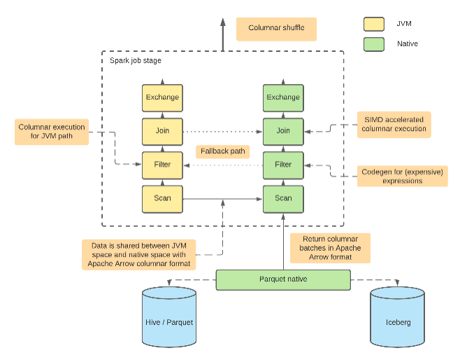

# Datafusion Comet

Hi!

Recently I moved to Rust and working on several projects - more insights to come ... one of them was Datafusion - an extremely fast SQL query engine.

I will have some posts/code to share with a few interesting findings, and one of them is Comet - it is a side project that could be used inside Spark - as a separate executor (written in Rust).

## Apache Datafusion Comet intro

Comet is an Apache Spark plugin that uses Apache Arrow DataFusion to accelerate Spark workloads. It is designed as a drop-in replacement for Spark’s JVM-based SQL execution engine and offers significant performance improvements for some workloads as shown below.

Apache Spark is a stable, mature project developed for many years. It is one of the best frameworks to scale out for processing large-scale datasets. However, the Spark community has had to address performance challenges that require various optimizations over time. Pain points include (not full list):

- JVM memory/CPU overhead
- Performance issues
- Lack of support of native SIMD instructions

There are a few libraries like Arrow, and Datafusion. Using features like native implementation, columnar data format, and vectorized data processing, these libraries can outperform Spark's JVM-based SQL engine.

## High-level functionality

- Offload performance-critical data processing to the native execution engine
- Automated conversion of Spark’s physical plan  -> Datafusion plan
- Native Operators for Spark execution- (Filter/Project/Aggregation/Join/Exchange)
- Spark built-in expressions
- Easy migration of legacy Spark UDF And UDAF

## Why it is interesting

The last feature may not sound impressive but from a business perspective is massive - it could allow companies that are dependent on Java to move to Rust ;-)

Another main point is:
Since Datafusion soon will be top ASF project, Comet as part of that will gain more potential and will closely align with Spark development.

 ----
## Others

- [Databricks Photon Engine](https://www.databricks.com/product/photon) – C++, seamless Spark integration
- [Spark RAPIDS (NVIDIA)](https://github.com/nvidia/spark-rapids) – GPU executor plugin – most advanced (with build-in Java-to-GPU UDF compilator)
- [Gluten (Intel) project based on Velox](https://github.com/oap-project/gluten) – accepted recently into Apache Incubator - the functionality may be similar, the technology (Rust vs C/C++) and the communities are different.
- [Blaze (Datafusion based)](https://github.com/blaze-init/blaze) - has the same design goal ( it may help consolidate efforts), but a different approach (not ASF).

----
Tags:
rust, spark, datafusion, comet, parquet, iceberg, plugins, rapids, photon, gluten, blaze, jvm,

----
Published: 04/02/2024

